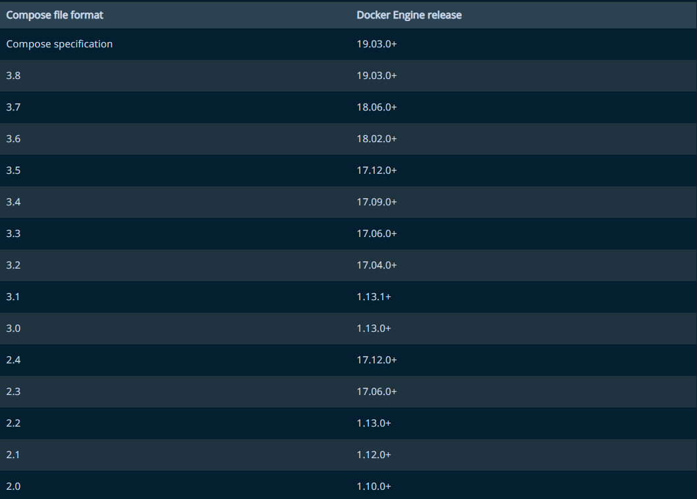

## 一、下载及安装

#### 1. 下载【注意与docker版本的对应】



```shell
curl -L "https://github.com/docker/compose/releases/download/1.29.2/docker-compose-$(uname -s)-$(uname -m)" -o /usr/local/bin/docker-compose          
```

### 2. 文件赋权

```shell
 chmod +x /usr/local/bin/docker-compose   
```

### 3. 验证版本

```shell
docker-compose --version
```

## 二、Docker-compose命令

#### 1. 命令说明

```shell
docker-compose build：构建/重新构建所有镜像

当某个service的Dockerfile改变时，即镜像发生改变需要重新生成时，如果仅仅是docker-compose.yml改变，只需要up重新启动project即可

docker-compose start [serviceName]：启动已存在但停止的所有service

（可选）serviceName：表示启动某一个service

docker-compose up -d（相当于 build + start ） ：构建（容器）并启动（容器）整个project的所有service；-d：后台进程

--scale：指定服务运行的容器个数（如果服务有对外的端口就不能指定多个容器，因为端口已经被占用）   Eg：docker-compose up -d --scale web=1 --scale redis=2

docker-compose stop [serviceName]：停止运行的service

（可选）serviceName：表示停止某一个service

docker-compose rm -f [serviceName]：删除已停止的所有service

（可选）serviceName：表示删除已停止某一个service（可以用docker-compose up重新构建service）；-f ：删除不在询问

docker-compose down -v（相当于 stop + rm ）：停止并移除整个project的所有services；-v ：删除挂载卷和volunme的链接

docker-compose logs [serviceName]：查看服务内所有容器日志输出，

加上serviceName表示输出某一个service的日志；-f：实时输出日志

docker-compose run service command：在某个服务上运行命令

Eg：docker-compose run web ping www.baidu.com

docker-compose exec [serviceName] sh：进入到某个容器

--index:2  ：当服务内有多个容器时，需要指定第几个，默认是第一个  Eg：docker-compose exec --index=2 web sh

docker-compose restart [serviceName]: 重启服务

docker-compose config：验证和查看compose文件

docker-compose images：列出所用的镜像

docker-cpmpose scale：设置服务个数 Eg：docker-compose scale web=2 worker=3 

docker-compose pause [serviceName]：暂停服务

docker-compose unpause [serviceName]：恢复服务
```

## 三、Docker-compose.yaml文件

#### 1 官网地址

https://github.com/compose-spec/compose-spec/blob/master/spec.md

#### 2.【project、service、container】三者对应关系

一个docker-compose.yml文件组成一个project，project里包含多个service，每个service定义了容器运行的镜像、端口、文件挂载等参数，一个service可包含同一个镜像的多个容器实例。

#### 3 常见流程

启动：创建docker-compose.yaml -> docker-compose pull -> docker-compose up -d

更新：docker-compose down -v -> docker-compose pull -> docker-compose up -d

#### 4 YAML文件说明

