> 
>
> 本篇将我们前面学习到的技术：ElasticSearch、Beats、Kibana、Logstash 整合起来，做一个综合性的学习，目的是为了让小伙伴们能够更加深刻的理解ElasticStack的使用

## 流程说明


- 应用APP生产日志，用来记录用户的操作
  - [INFO] 2019-03-15 22:55:20 [Main] - DAU|5206|使用优惠券|2019-03-15 03:37:20
  - [INFO] 2019-03-15 22:55:21 [Main] - DAU|3880|浏览页面|2019-03-15 07:25:09
- 通过Filebeat读取日志文件中的内容，并且将内容发送给Logstash，原因是需要对内容做处理
- Logstash接收到内容后，进行处理，如分割操作，然后将内容发送到Elasticsearch中
- Kibana会读取Elasticsearch中的数据，并且在Kibana中进行设计Dashboard，最后进行展示

> 说明：日志格式、图表、Dashboard都是自定义的

## App介绍

APP在生产环境应该是真实系统，然而，现在我们学习的话，为了简化操作，所以就做数据的模拟生成即可。

业务代码如下：

```java
package com.log;

import lombok.extern.slf4j.Slf4j;
import org.apache.commons.lang3.RandomUtils;
import org.joda.time.DateTime;
import org.springframework.boot.autoconfigure.SpringBootApplication;

@Slf4j
@SpringBootApplication
public class Main {

    public static final String[] VISIT = new String[]{"浏览页面", "评论商品", "加入收藏", "加入购物车", "提交订单", "使用优惠券", "领取优惠券", "搜索", "查看订单"};

    public static void main(String[] args) throws Exception {
        while(true){
            Long sleep = RandomUtils.nextLong(200, 1000 * 5);
            Thread.sleep(sleep);
            Long maxUserId = 9999L;
            Long userId = RandomUtils.nextLong(1, maxUserId);
            String visit = VISIT[RandomUtils.nextInt(0, VISIT.length)];
            DateTime now = new DateTime();
            int maxHour = now.getHourOfDay();
            int maxMillis = now.getMinuteOfHour();
            int maxSeconds = now.getSecondOfMinute();
            String date = now.plusHours(-(RandomUtils.nextInt(0, maxHour)))
                    .plusMinutes(-(RandomUtils.nextInt(0, maxMillis)))
                    .plusSeconds(-(RandomUtils.nextInt(0, maxSeconds)))
                    .toString("yyyy-MM-dd HH:mm:ss");

            String result = "DAU|" + userId + "|" + visit + "|" + date;
            log.error(result);
        }
    }
}
```

我们可以启动运行，就是不断的生成日志，模拟了我们的实际业务

```bash
09:18:32.721 [main] ERROR com.log.Main - DAU|8183|加入购物车|2020-09-25 06:10:25
09:18:33.599 [main] ERROR com.log.Main - DAU|7097|提交订单|2020-09-25 06:18:31
09:18:37.265 [main] ERROR com.log.Main - DAU|1468|查看订单|2020-09-25 02:04:10
09:18:39.634 [main] ERROR com.log.Main - DAU|7821|领取优惠券|2020-09-25 02:04:07
09:18:41.909 [main] ERROR com.log.Main - DAU|7962|提交订单|2020-09-25 03:02:39
09:18:43.596 [main] ERROR com.log.Main - DAU|3358|评论商品|2020-09-25 08:14:19
```

然后我们将该项目使用下面命令进行打包

```bash
mvn clean install
```

打包完成后，到target目录下，能够看到我们生成的jar包

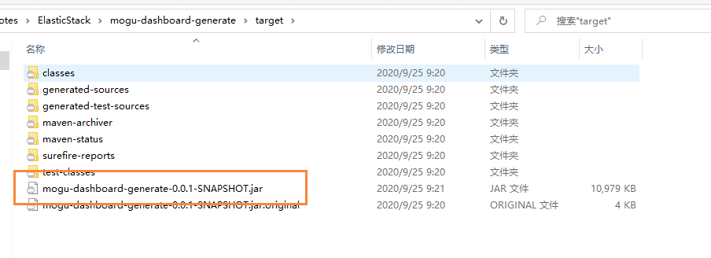

我们将其复制到我们的服务器上，然后创建一个启动的脚本 startup.sh

```bash
#!/bin/bash     
nohup java  -Xms256m -Xmx512m -jar  mogu-dashboard-generate-0.0.1-SNAPSHOT.jar  > app.log  2>&1 &
```

然后就使用脚本进行启动

```bash
# 启动
./startup.sh
# 启动成功后，会看到一个日志 app.log，我们可以查看
tail -f app.log
```

## 配置Filebeat

在有了不断产生日志的应用程序后，我们就需要创建一个Filebeat的配置文件，用于日志的收集

```bash
# 打开配置文件
vim  mogu-dashboard.yml

# 写入数据
filebeat.inputs:
- type: log
  enabled: true
  paths:
    - /soft/app/*.log
setup.template.settings:
  index.number_of_shards: 1
output.logstash:
  hosts: ["127.0.0.1:5044"]
```

然后我们就可以启动了【需要我们把Logstash启动起来】

```bash
./filebeat -e -c mogu-dashboard.yml
```

## 配置Logstash

### Logstash输出到控制台

Logstash的主要目的就是处理Filebeat发送过来的数据，进行数据的清洗，过滤等，我们首先简单的将logstash获得的数据输出到控制台

```bash
# 打开配置文件
vim  mogu-dashboard.conf

# 添加以下内容
input {
	beats {
		port => "5044"
	}
}
output {
	stdout { codec => rubydebug }
}
```

然后启动我们的logstash 【注意，启动时间比较长，需要我们等待】

```bash
./bin/logstash -f mogu-dashboard.conf
```

启动logstash完成后，我们需要再次启动filebeat，回到上面的启动步骤，然后就能看到logstash输出我们的日志

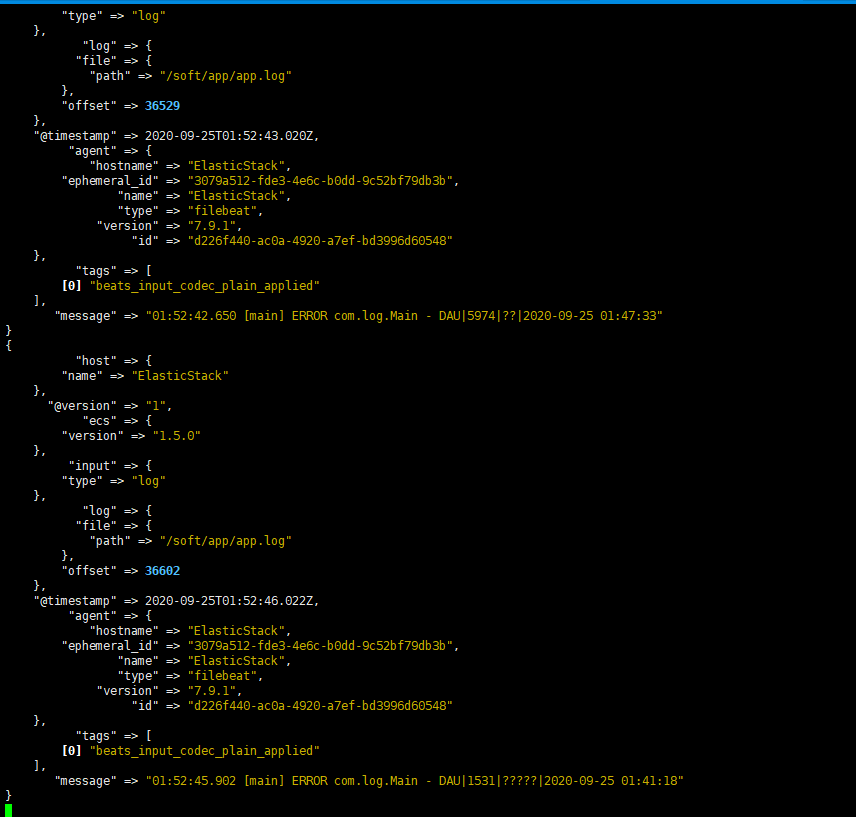

### 配置Logstash连接ElasticSearch

上面的数据，其实还是我们的原始数据，并没有经过处理，所以我们这个时候就需要使用到Logstash的其它功能了。我们继续修改配置文件

```bash
# 打开配置文件
vim  mogu-dashboard.conf
```

然后修改一下的值

```bash
input {
        beats {
                port => "5044"
        }
}
filter {
        mutate {
                split => {"message"=>"|"}
        }
        mutate {
                add_field => {
                "userId" => "%{[message][1]}"
                "visit" => "%{[message][2]}"
                "date" => "%{[message][3]}"
                }
        }
        mutate {
                convert => {
                "userId" => "integer"
                "visit" => "string"
                "date" => "string"
                }
        }
        mutate {
           remove_field => [ "host" ]
        }
}
#output {
# stdout { codec => rubydebug }
#}

output {
  elasticsearch {
    hosts => [ "127.0.0.1:9200"]
  }
}
```

然后再次启动

```bash
./bin/logstash -f mogu-dashboard.conf
```

其实能够看到，我们原来的数据，就经过了处理了，产生了新的字段

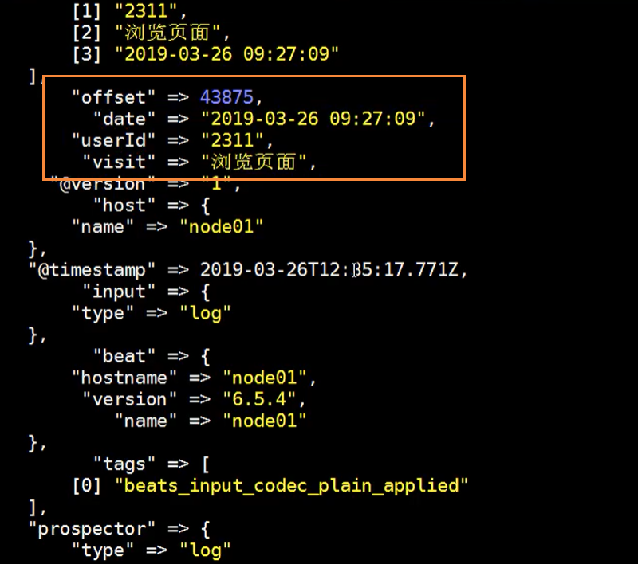

同时我们还可以对我们的数据，进行类型转换，为了方便我们的下游进行处理

```bash
	mutate {
		convert => {
		"userId" => "integer"
		"visit" => "string"
		"date" => "string"
		}
	}
```

### 遇到的问题1

```bash
[2020-09-25T02:32:44,042][WARN ][logstash.filters.mutate  ][main][5fd6a2f2f396816d849f2e3e2e0a53f2500a9b58c6819e23f42d2bfd34cde207] Exception caught while applying mutate filter {:exception=>"Invalid FieldReference: `message[1]`"}
```

不断的刷这个错误，配置文件没问题，但添加字段那一个mutate需要给message套一层中括号：

```bash
mutate {
    add_field => {
        "userId" => "%{[message][1]}"
        "visit" => "%{[message][2]}"
        "date" => "%{[message][3]}"
    }
}
```

### 遇到的问题2

filebeat 传输到host的字段中host是一个对象

```bash
failed to parse field [host] of type [text] in document
```

解决方法就是过滤掉host字段

```bash
mutate {
	remove_field => [ "host" ]
}

```

## 启动ElasticSearch

在我们通过Logstash发送数据到ElasticSearch，所以我们还需要启动我们的ElasticSearch

```bash
# 切换到elsearch用户
su elsearch

# 到目录
cd /soft/elsearch/bin

# 启动
./elasticsearch
```

## 启动Kibana

我们最后就需要通过Kibana来展示我们的图形化数据

```bash
# 启动kibana
./bin/kibana

# 通过浏览器访问
http://202.193.56.222:5601/app/kibana
```

### 添加到索引库

添加Logstash索引到Kibana中：

```bash
http://202.193.56.222:5601/app/management/kibana/indexPatterns/create
```

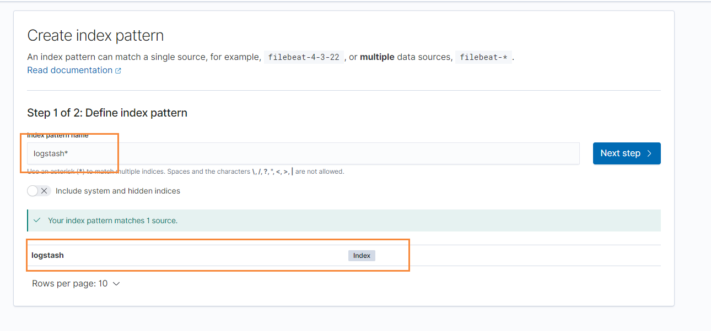

输入我们的匹配规则，然后匹配到logstash，然后选择时间字段后创建

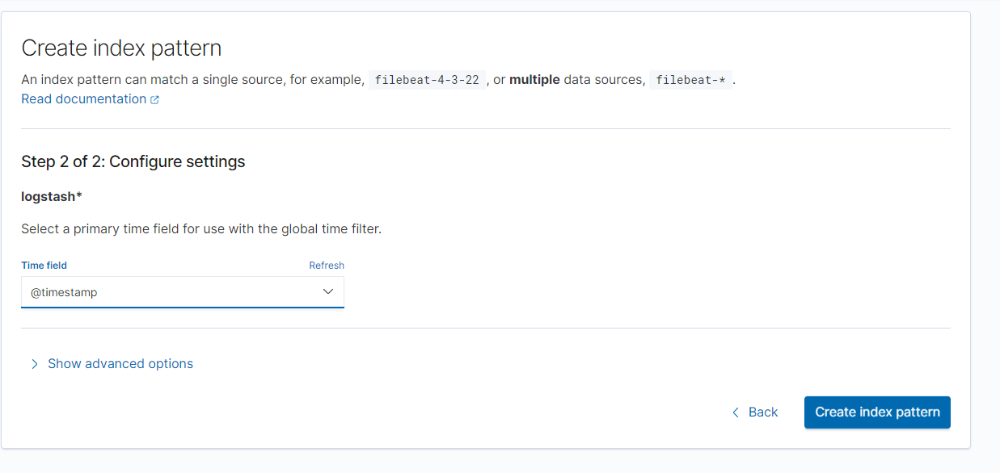

### 创建柱形图

我们点击右侧Visualizations，然后开始创建图标


然后选择柱形图


在选择我们的索引

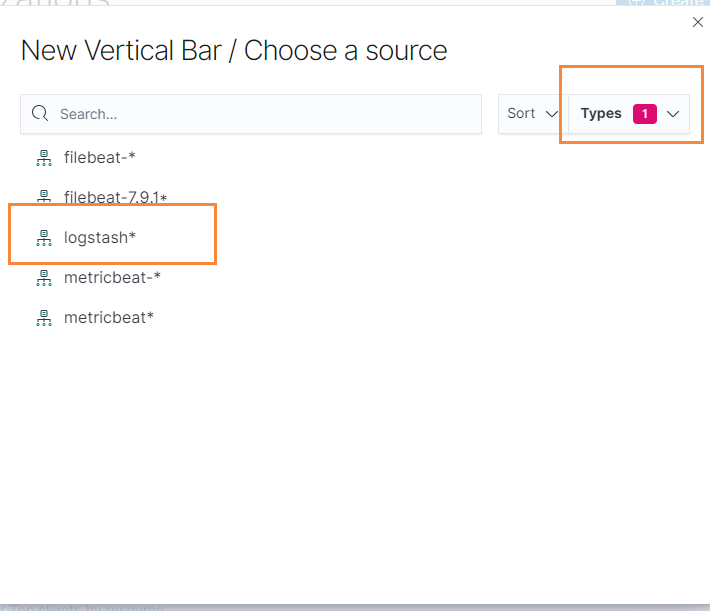


最后我们定义我们的X轴，选择按照时间进行添加

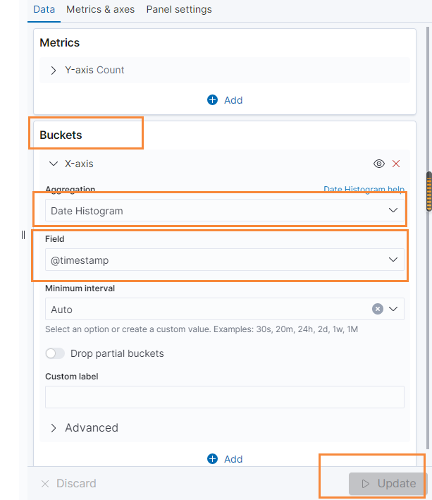

最后更新我们的页面，然后在选择最近的30分钟

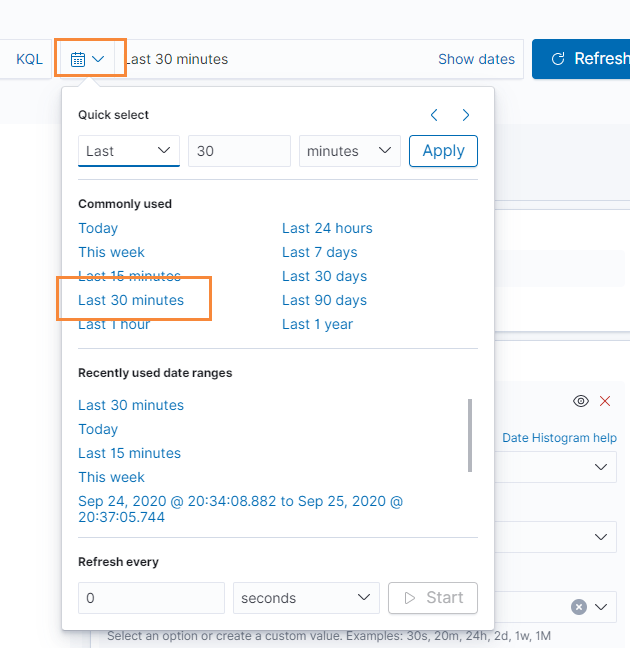

就能够看到我们的日志在源源不断的生成了，同时我们可以对我们的这个图表进行保存

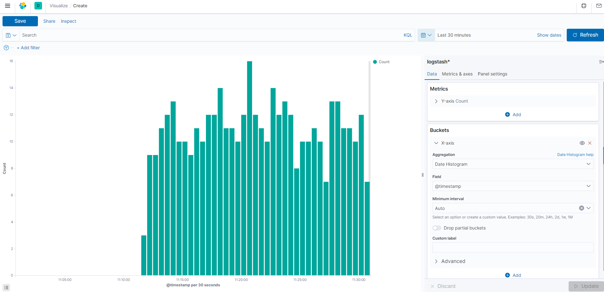


### 创建饼图

我们继续选择饼图

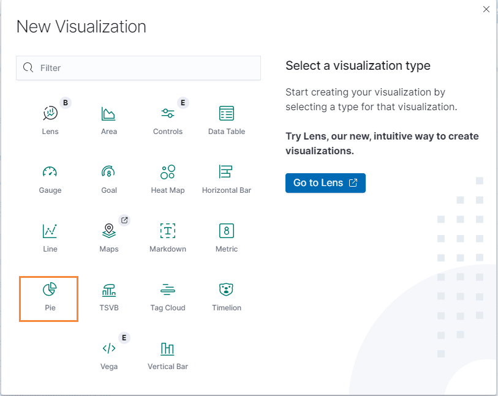

然后选择我们的索引

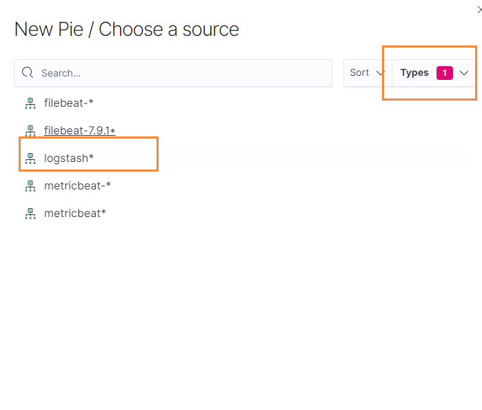

添加完成后，我们就看到这样一个页面了

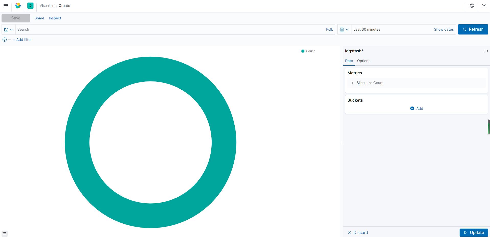

但是这样还不死很直观，所以我们还需要做处理，找到右侧的Buckets，然后选择Split Slices，然后把我们的每个字段都添加上去，其中visit指的是我们es中的属性

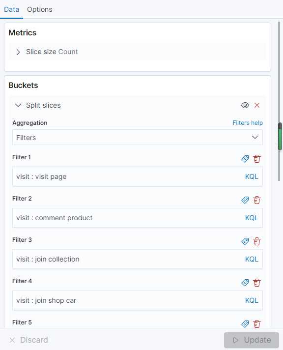


最后选择update，得到的效果如下所示

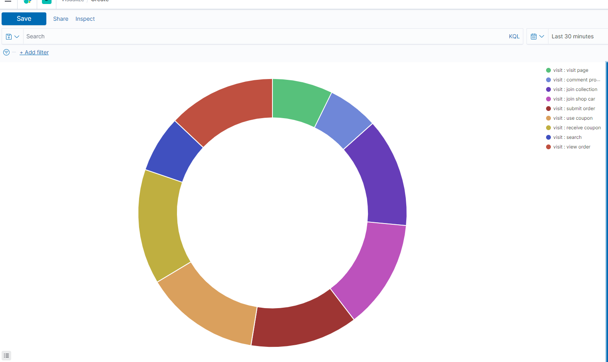

我们还可以继续给每个字段都添加label标签

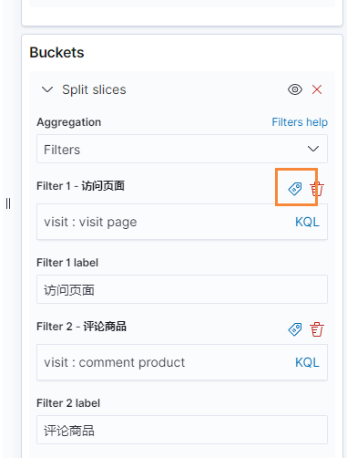

添加完成后，更新页面，就得到非常不错的效果了~

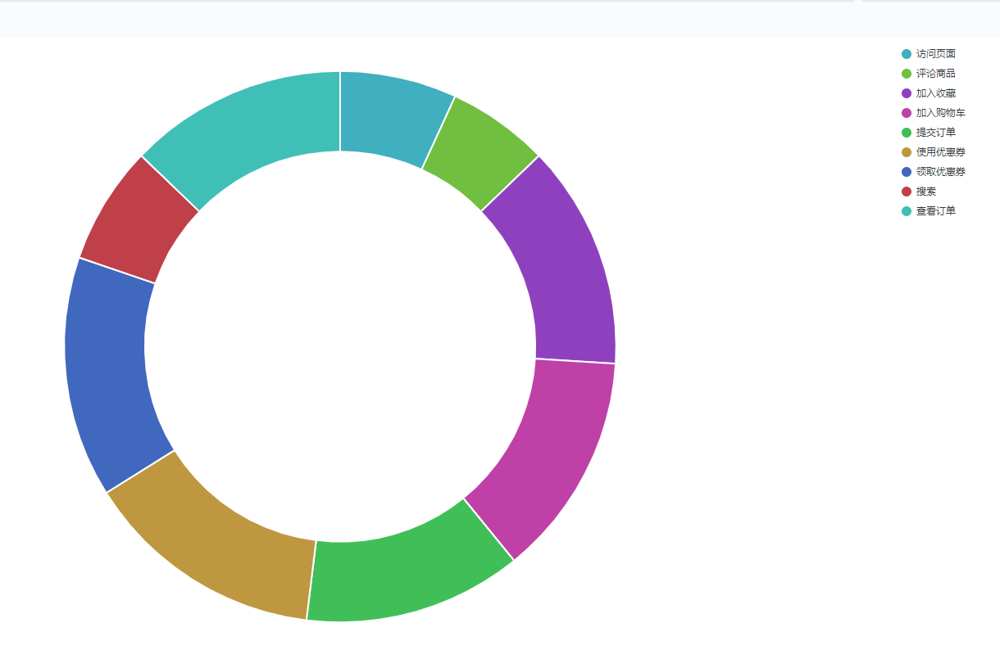

### 数据表格

在图标中，选择我们需要显示的字段即可

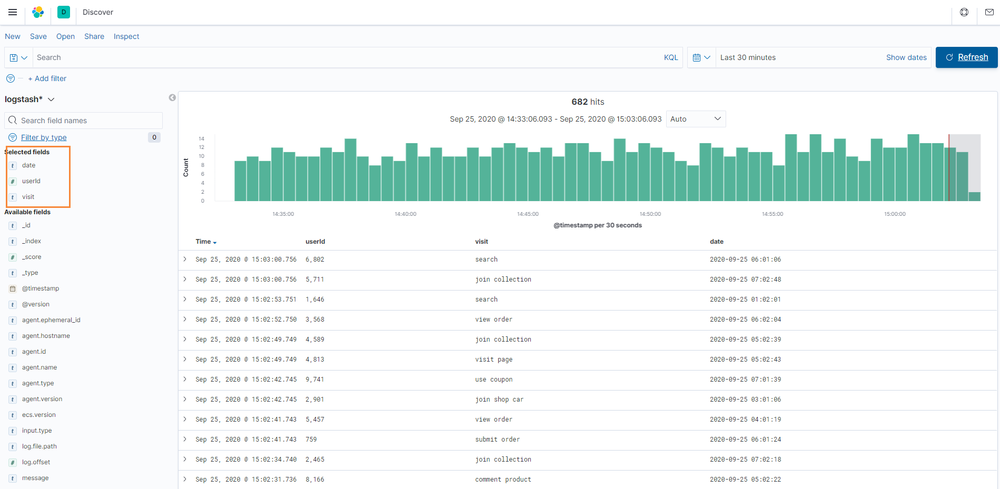

## 制作Dashboard

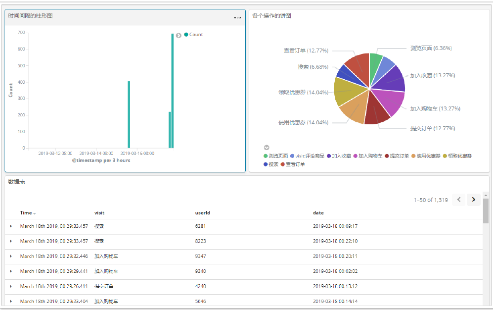