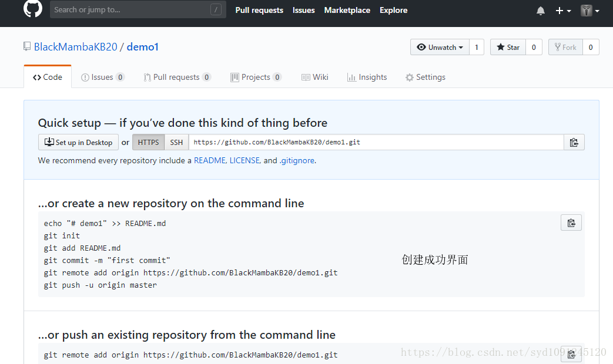

> 首先保证本地已安装git

#### 1.创建GitHub仓库



#### 2.项目上传

（1） 选中要关联的项目文件夹，右键**”Git bash here“**打开git终端

（2）初始化项目

```shell
git init
```

（3）关联远程仓库

```shell
git remote add origin [GitHub仓库地址]
```

参数说明：

* origin：本地仓库名

（4）添加文件

```shell
git add [参数]
```

参数说明：参数可以是具体的文件名、文件夹、文件通配符、所有文件（.）

（5）提交到本地仓库

```shell
git commit -m "描述“
```

（6）发布到远程仓库

```shell
git push -u origin master
```

#### 3.问题解决

（1） git commit命令报错：**Author identity unknown**

```shell
git config --global user.name “GitHub账号名字”
git config --global user.email “GitHub邮箱地址”
```

（2）git push命令报错：**OpenSSL SSL_read: Connection was aborted, , errno 10053**

```shell
git config --global http.postBuffer 524288000
```

