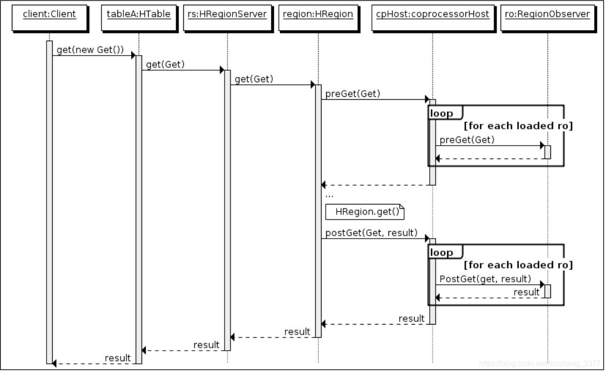

#### 1.产生背景

>Hbase作为列族数据库最经常被人诟病的特性包括:无法轻易建立“二级索引”，难以执行求和、计数、排序等操作。比如，在旧版本的(<0.92)Hbase中，统计数据表的总行数，需要使用 Counter 方法，执行一次 MapReduce Job 才能得到。虽然 HBase在数据存储层中集成了 MapReduce，能够有效用于数据表的分布式计算。然而在很多情况下，做一些简单的相加或者聚合计算的时候，如果直接将计算过程放置在 server 端，能够减少通讯开销，从而获得很好的性能提升。
>于是，HBase 在 0.92之后引入了协处理器(coprocessors)，实现一些激动 人心的新特性:能够轻易建立二次索引、复杂过滤器(谓词下推)以及访问控制等。

#### 2.分类

* observer

  > observer类似于mysql中的**触发器**，zookeeper中的监听器，主要的作用是当执行被监听的一个操作的时候可以触发另一个我们需要的操作的依赖关系，比如说监听数据库数据的增删过程，我们可以在hbase数据库插入数据或者删除数据之前或之后进行一系列的操作（ps：有很多博客说的是钩子函数，其实没错，但是便于理解，这里就不引入钩子的概念了）

* endpoint

  > Endpoint 协处理器类似传统数据库中的**存储过程**，客户端可以调用这些 Endpoint 协处理器执行一段 Server端代码，并将Server 端代码的结果返回给客户端进一步处理，最常见的用法就是进行聚集操作。

observer工作原理：



#### 3.动态加载协处理器

3.1.配置hbase-env.sh

```properties
export HBASE_CLASSPATH=hdfs://localhost:9000/hbase
```

3.2.使用

```sql
# step 1
disable 'raonecloud'
# step 2
alter 'raonecloud', METHOD => 'table_att','coprocessor'=>'hdfs://10.0.1.175:9000/hbase/observer.jar|com.obs.observerc.ObserverUtil|1001|'
# step 3
enable 'raonecloud'
```

3.3.卸载

```sql
# step 1
disable 'raonecloud'
# step 2
alter 'raonecloud',METHOD=>'table_att_unset',NAME=>'coprocessor$1'
# step 3
enable 'raonecloud'
```

