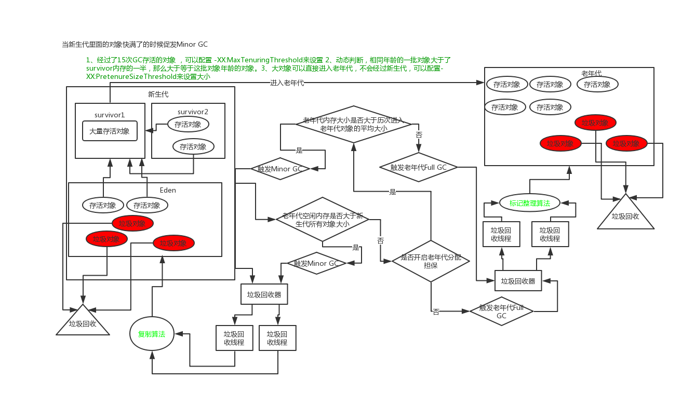
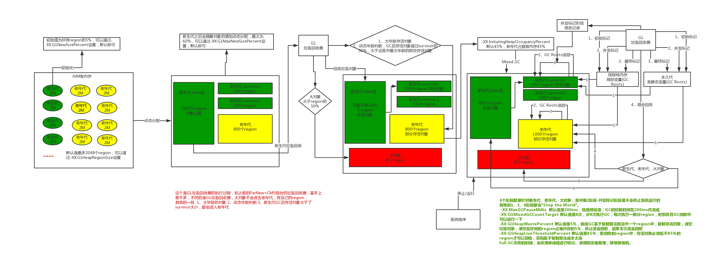

关于java命令的参数讲解:

```shell
JAVA_OPTS="-Dfile.encoding=UTF-8 
-server //服务端模式启动，启动慢，单启动后性能高
-Xms4096m //堆内存初始化大小 默认物理内存的1/64 最大不会超过1G
-Xmx4096m //堆内存最大大小  默认物理内存的1/4 最大不会超过1G
-Xmn=2048m //堆内存新生代大小，剩余的就是老年代内存大小
-Xss1m //每个线程对应的Java虚拟机栈的大小
-XX:PermSize=256m //永久代初始化大小 默认物理内存的1/64 最大不会超过1G
-XX:MaxPermSize=256m //最低达永久代大小 默认物理内存的1/4 最大不会超过1G
-XX:HandlePromotionFailure  //JDK1.6以后已经废弃了这个参数了，所以如果用的是JDK1.6以后的版本的话，就不用这个参数了 
-XX:SurvivorRatio=8 //新生代中Eden区和Survivor区的比例,默认就是8  8:1:1  也就是Eden区的内存大小占整个新生代的80%
-XX:MaxTenuringThreshold=5 //新生代中存活对象被Minor GC多少次以后进入老年代，既然是多次了，就说明是静态变量或全局的单例，所以没有必要一直在新生代，赶紧的去老年代吧，所以设置的次数少一些，默认是15
-XX:PretenureSizeThreshold=1m //设置大对象的大小，直接进入老年代，不经过新生代
-XX:+UseParNewGC //设置新生代的垃圾回收器为ParNew
-XX:+UseConcMarkSweepGC //设置老年代的垃圾回收器为CMS
-XX:CMSInitiatingOccupancyFaction=92 //老年代内存占用率达到92%时，开始进行Full GC
-XX:+UseCMSCompactAtFullCollection //设置每次Full GC后 都要进行一次内存整理，为了防止产生内存碎片
-XX:CMSFullGCsBeforeCompaction=0 //设置多少次Full GC后,进行一次内存整理，就是说这里优化好了以后，不会很频繁的Full GC,也就没有必要每次都进行整理
-XX:+DisableExplicitGC" //禁止代码中显示调用GC
```

垃圾回收原理：



