## ThreadLocal介绍

从Java官方文档中的描述：ThreadLocal类用来提供线程内部的局部变量。这种变量在多线程环境下访问（通过get和set方法访问）时能保证各个线程的变量相对独立于其他线程内的变量。ThreadLocal实例通常来说都是private static类型的，用于关联线程和线程上下文。

我们可以得知ThreadLocal的作用是：提供线程内的局部变量，不同的线程之间不会相互干扰，这种变量在线程的生命周期内起作用，减少同一个线程内多个函数或组件之间一些公共变量传递的复杂度。

- 线程并发：在多线程并发的场景下
- 传递数据：我们可以通过ThreadLocal在同一线程，不同组件之间传递公共变量（有点类似于Session？）
- 线程隔离：每个线程的变量都是独立的，不会互相影响

## 基本使用

在介绍Thread使用之前，我们首先认识几个Thread的常见方法

| 方法声明                 | 描述                       |
| ------------------------ | -------------------------- |
| ThreadLocal()            | 创建ThreadLocal对象        |
| public void set(T value) | 设置当前线程绑定的局部变量 |
| public T get()           | 获取当前线程绑定的局部变量 |
| public void remove()     | 移除当前线程绑定的局部变量 |

## 使用案例

我们来看下面这个案例，感受一下ThreadLocal线程隔离的特点

```java
/**
 * 需求：线程隔离
 * 在多线程并发的场景下，每个线程中的变量都是相互独立的
 * 线程A：设置变量1，获取变量2
 * 线程B：设置变量2，获取变量2
 */
public class MyDemo01 {
    // 变量
    private String content;

    public String getContent() {
        return content;
    }

    public void setContent(String content) {
        this.content = content;
    }

    public static void main(String[] args) {
        MyDemo01 myDemo01 = new MyDemo01();
        for (int i = 0; i < 5; i++) {
            new Thread(() -> {
                myDemo01.setContent(Thread.currentThread().getName() + "的数据");
                System.out.println("-----------------------------------------");
                System.out.println(Thread.currentThread().getName() + "\t  " + myDemo01.getContent());
            }, String.valueOf(i)).start();
        }
    }
}
```

运行后的效果

```bash
-----------------------------------------
-----------------------------------------
-----------------------------------------
3	  4的数据
-----------------------------------------
2	  4的数据
-----------------------------------------
1	  4的数据
4	  4的数据
0	  4的数据
```

从上面我们可以看到，出现了线程不隔离的问题，也就是线程1取出了线程4的内，那么如何解决呢？

这个时候就可以用到ThreadLocal了，我们通过 set 将变量绑定到当前线程中，然后 get 获取当前线程绑定的变量

```java
/**
 * 需求：线程隔离
 * 在多线程并发的场景下，每个线程中的变量都是相互独立的
 * 线程A：设置变量1，获取变量2
 * 线程B：设置变量2，获取变量2
 */
public class MyDemo01 {
    // 变量
    private String content;

    public String getContent() {
        return content;
    }

    public void setContent(String content) {
        this.content = content;
    }

    public static void main(String[] args) {
        MyDemo01 myDemo01 = new MyDemo01();
        ThreadLocal<String> threadLocal = new ThreadLocal<>();
        for (int i = 0; i < 5; i++) {
            new Thread(() -> {
                threadLocal.set(Thread.currentThread().getName() + "的数据");
                System.out.println("-----------------------------------------");
                System.out.println(Thread.currentThread().getName() + "\t  " + threadLocal.get());
            }, String.valueOf(i)).start();
        }
    }
}
```

我们引入ThreadLocal后，查看运行结果

```
-----------------------------------------
-----------------------------------------
4	  4的数据
-----------------------------------------
3	  3的数据
-----------------------------------------
2	  2的数据
-----------------------------------------
1	  1的数据
0	  0的数据
```

我们发现不会出现上面的情况了，也就是当前线程只能获取线程线程存储的对象

## ThreadLocal类和Synchronized关键字

### Synchronized同步方式

对于上述的例子，我们完全可以通过加锁的方式来实现这个功能，我们来看一下用Synchronized代码块实现的效果：

```java
    public static void main(String[] args) {
        MyDemo03 myDemo01 = new MyDemo03();
        for (int i = 0; i < 5; i++) {
            new Thread(() -> {
                synchronized (MyDemo03.class) {
                    myDemo01.setContent(Thread.currentThread().getName() + "的数据");
                    System.out.println("-----------------------------------------");
                    System.out.println(Thread.currentThread().getName() + "\t  " + myDemo01.getContent());
                }
            }, String.valueOf(i)).start();
        }
    }
```

运行结果如下所示，我们发现我们可以看到同样实现了功能，但是并发性降低了

```
-----------------------------------------
0	  0的数据
-----------------------------------------
4	  4的数据
-----------------------------------------
3	  3的数据
-----------------------------------------
2	  2的数据
-----------------------------------------
1	  1的数据
```

### ThreadLocal与Synchronized的区别

虽然ThreadLocal模式与Synchronized关键字都用于处理多线程并发访问变量的问题，不过两者处理问题的角度和思路不同。

|        | Synchronized                                                 | ThreadLocal                                                  |
| ------ | ------------------------------------------------------------ | ------------------------------------------------------------ |
| 原理   | 同步机制采用以时间换空间的方式，只提供了一份变量，让不同的线程排队访问 | ThreadLocal采用以空间换时间的概念，为每个线程都提供一份变量副本，从而实现同时访问而互不干扰 |
| 侧重点 | 多个线程之间访问资源的同步                                   | 多线程中让每个线程之间的数据相互隔离                         |

总结：在刚刚的案例中，虽然使用ThreadLocal和Synchronized都能解决问题，但是使用ThreadLocal更为合适，因为这样可以使程序拥有更高的并发性。

## 运用场景

通过以上的介绍，我们已经基本了解ThreadLocal的特点，但是它具体是运用在什么场景中的呢？接下来让我们看一个案例：事务操作

### 转账案例

这里们先构建一个简单的转账场景：有一个数据表account，里面有两个用户 jack 和 Rose，用户Jack给用户Rose转账。案例的实现主要是用mysql数据库，JDBC和C3P0框架，以下是详细代码

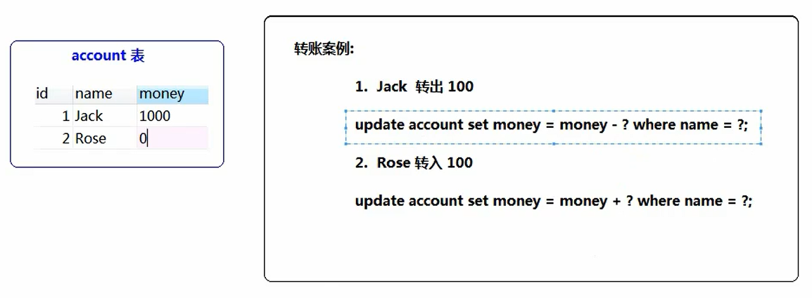

### 引入事务

案例中转账涉及两个DML操作：一个转出，一个转入。这些操作是需要具备原子性的，不可分割。不然有可能出现数据修改异常情况。

```java
public class AccountService {
    public boolean transfer(String outUser, String isUser, int money) {
        AccountDao ad = new AccountDao();
        try {
            // 转出
            ad.out(outUser, money);
            // 模拟转账过程中的异常
            int i = 1/0;
            // 转入
            ad.in(inUser, money);
        } catch(Exception e) {
            e.printStackTrace();
            return false;
        }
        return true;
    }
}
```

所以这里就需要操作事务，来保证转入和转出具备原子性，要么成功，要么失败。

JDBC中关于事务操作的API

| Connection接口的方法      | 作用                             |
| ------------------------- | -------------------------------- |
| void setAutoCommit(false) | 禁用事务自动提交（改为手动提交） |
| void commit()             | 提交事务                         |
| void rollbakc()           | 回滚事务                         |

开启事务的注意点

为了保证所有操作在一个事务中，案例中使用的连接必须是同一个；service层开启事务的connection需要跟dao层访问数据库的connection保持一致

线程并发情况下，每个线程只能操作各自的connection，也就是线程隔离

### 常规解决方法

基于上面给出的前提，大家通常想到的解决方法

- 从service层将connection对象向dao层传递
- 加锁

### 常规解决方法的弊端

- 提高代码的耦合度（因为我们需要从service 层 传入 connection参数）
- 降低程序的性能（加了同步代码块，失去了并发性）

这个时候就可以通过ThreadLocal和当前线程进行绑定，来降低代码之间的耦合

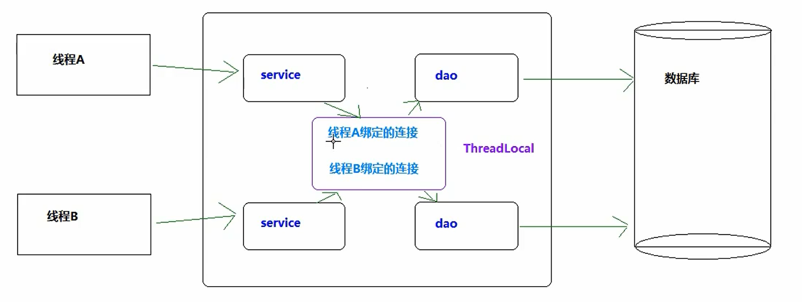

### 使用ThreadLocal解决

针对上面出现的情况，我们需要对原来的JDBC连接池对象进行更改

- 将原来从连接池中获取对象，改成直接获取当前线程绑定的连接对象
- 如果连接对象是空的
  - 再去连接池中获取连接
  - 将此连接对象跟当前线程进行绑定

```java
ThreadLocal<Connection> tl = new ThreadLocal();
public static Connection getConnection() {
    Connection conn = tl.get();
    if(conn == null) {
        conn = ds.getConnection();
        tl.set(conn);
    }
    return conn;
}
```

### ThreadLocal实现的好处

从上述的案例中我们可以看到，在一些特定场景下，ThreadLocal方案有两个突出的优势：

- 传递数据：保存每个线程绑定的数据，在需要的地方可以直接获取，避免参数直接传递带来的代码耦合问题
- 线程隔离：各线程之间的数据相互隔离却又具备并发性，避免同步方式带来的性能损失

## ThreadLocal的内部结构

通过以上的学习，我们对ThreadLocal的作用有了一定的认识。现在我们一起来看一下ThreadLocal的内部结构，探究它能够实现线程数据隔离的原理。

### 常见误解

如果我们不去看源代码的话，可能会猜测 ThreadLocal 是这样子设计的：每个ThreadLocal都创建一个Map，然后用线程作为Map的key，要存储的局部变量作为Map的value，这样就能达到各个线程的局部变量隔离的效果。这是最简单的设计方法，JDK最早期的ThreadLocal确实是这样设计的，但现在早已不是了。

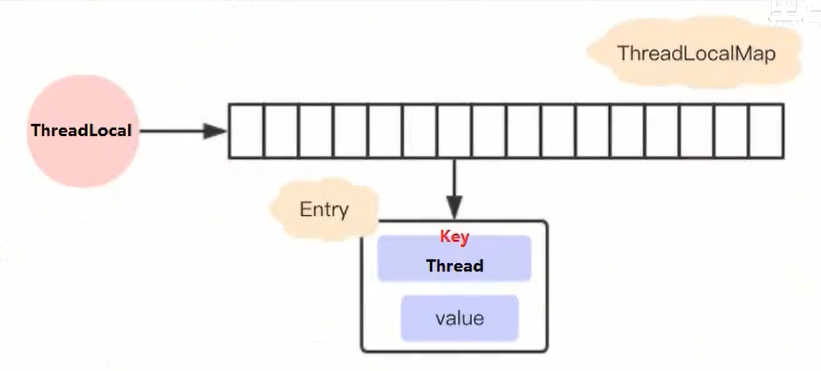

### 现在的设计

但是，JDK后面优化了设计方案，在JDK8中 ThreadLocal的设计是：每个Thread维护一个ThreadLocalMap，这个Map的key是ThreadLocal实例本身，value 才是真正要存储的值object。具体的过程是这样的：

- 每个Thread线程内部都有一个Map（ThreadLocalMap）
- Map里面存储ThreadLocal对象（key）和线程的变量副本（value）
- Thread内部的Map是由ThreadLocal维护的，由ThreadLocal负责向map获取和设置线程的变量值。
- 对于不同的线程，每次获取副本值时，别的线程并不能获取到当前线程的副本值，形成了副本的隔离，互不干扰。

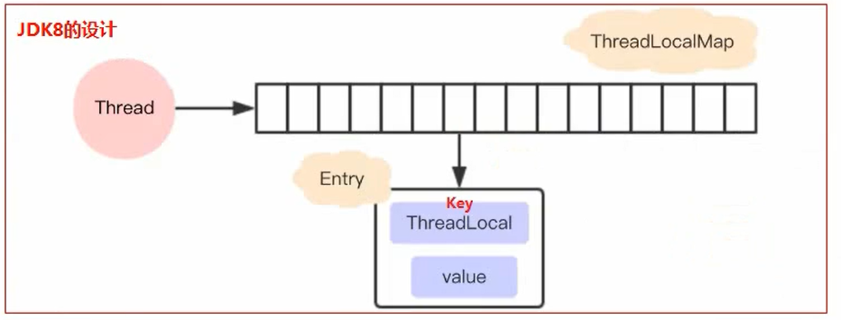

### 对比

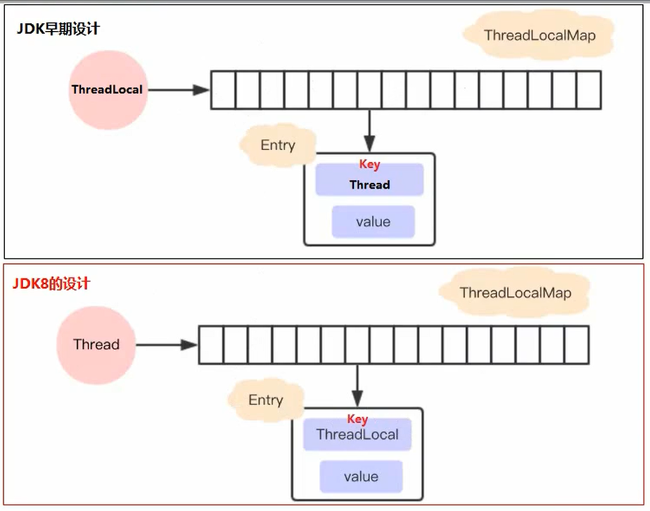

从上面变成JDK8的设计有什么好处？

- 每个Map存储的Entry数量变少，因为原来的Entry数量是由Thread决定，而现在是由ThreadLocal决定的
  - 真实开发中，Thread的数量远远大于ThreadLocal的数量
- 当Thread销毁的时候，ThreadLocalMap也会随之销毁，因为ThreadLocal是存放在Thread中的，随着Thread销毁而消失，能降低开销。

## ThreadLocal核心方法源码

基于ThreadLocal的内部结构，我们继续分析它的核心方法源码，更深入的了解其操作原理。
除了构造方法之外，ThreadLocal对外暴露的方法有以下4个

| 方法声明                   | 描述                         |
| -------------------------- | ---------------------------- |
| protected T initialValue() | 返回当前线程局部变量的初始值 |
| public void set(T value)   | 返回当前线程绑定的局部变量   |
| public T get()             | 获取当前线程绑定的局部变量   |
| public void remove()       | 移除当前线程绑定的局部变量   |

以下是这4个方法的详细源码分析（为了保证思路清晰，ThreadLocalMap部分暂时不展开，下一个知识点详解）

### set方法

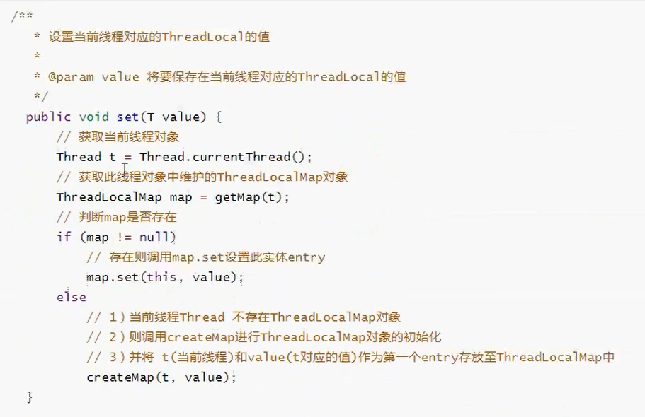

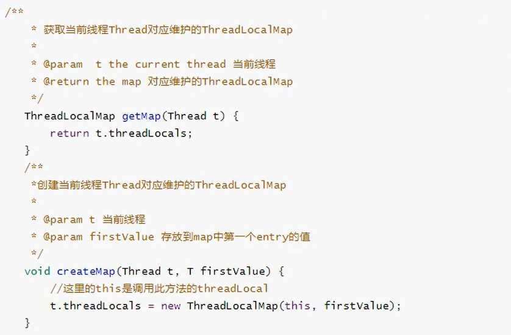

代码流程

- 首先获取当前线程，并根据当前线程获取一个Map
- 如果获取的Map不为空，则将参数设置到Map中（当前ThreadLocal的引用作为key）
- 如果Map为空，则给该线程创建Map，并设置初始化值

### get方法

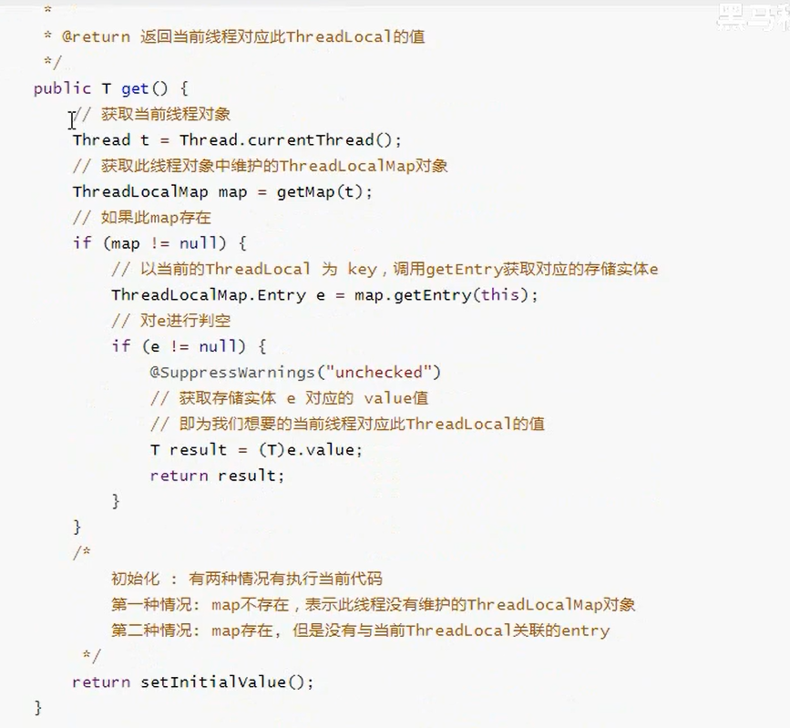

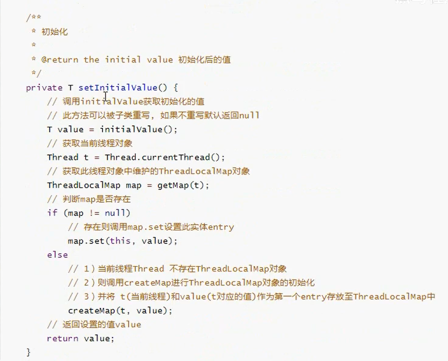

代码执行流程

- 首先获取当前线程，根据当前线程获取一个Map 
- 如果获取的Map不为空，则在Map中以ThreadLocal的引用作为key来在Map中获取对应的Entrye，否则转到第四步
-  如果e不为null，则返回e.value，否则转到第四步
- Map为空或者e为空，则通过initialValue函数获取初始值value，然后用ThreadLocal的引用和value作为firstKey和firstValue创建一个新的Map

总结：先获取当前线程的ThreadLocal变量，如果存在则返回值，不存在则创建并返回初始值

### remove方法

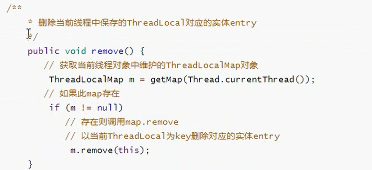

代码执行流程

- 首先获取当前线程，并根据当前线程获取一个Map
- 如果获取的Map不为空，则移除当前ThreadLocal对象对应的Entry

### initialValue方法

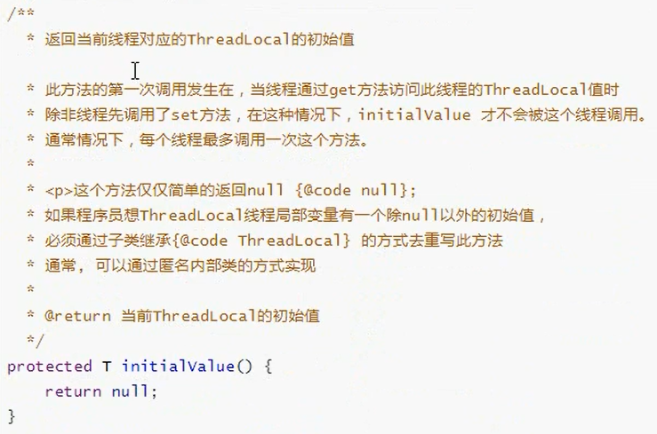

此方法的作用是返回该线程局部变量的初始值。

- 这个方法是一个延迟调用方法，从上面的代码我们得知，在set方法还未调用而先调用了get方法时才执行，并且仅执行1次。
- 这个方法缺省实现直接返回一个null。
- 如果想要一个除null之外的初始值，可以重写此方法。（备注：该方法是一个protected的方法，显然是为了让子类覆盖而设计的）

## ThreadLocalMap源码分析

在分析ThreadLocal方法的时候，我们了解到ThreadLocal的操作实际上是围绕ThreadLocalMap展开的。
ThreadLocalMap的源码相对比较复杂，我们从以下三个方面进行讨论。

### 基本结构

ThreadLocalMap是ThreadLocal的内部类，没有实现Map接口，用独立的方式实现了Map的功能，其内部的Entry也是独立实现。

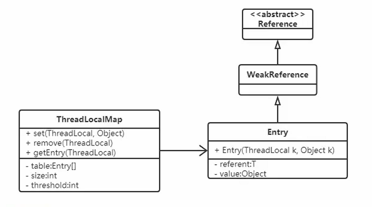

#### 成员变量

```java
/**
* 初始容量 - 必须是2的整次幂
**/
private static final int INITIAL_CAPACITY = 16;

/**
*存放数据的table ，Entry类的定义在下面分析，同样，数组的长度必须是2的整次幂
**/
private Entry[] table;

/**
*数组里面entrys的个数，可以用于判断table当前使用量是否超过阈值
**/
private int size = 0;

/**
*进行扩容的阈值，表使用量大于它的时候进行扩容
**/
private int threshold; // Default to 0
```

跟HashMap类似，INITIAL_CAPACITY代表这个Map的初始容量；table是一个Entry类型的数组，用于存储数据；size代表表中的存储数目；threshold代表需要扩容时对应的size的阈值。

### 存储结构 - Entry

```java
/*
*Entry继承WeakRefefence，并且用ThreadLocal作为key.
如果key为nu11（entry.get（）==nu11），意味着key不再被引用，
*因此这时候entry也可以从table中清除。
*/
static class Entry extends weakReference<ThreadLocal<?>>{

object value；Entry（ThreadLocal<？>k，object v）{
    super(k);
    value = v;
}}
```

在ThreadLocalMap中，也是用Entry来保存K-V结构数据的。不过Entry中的key只能是ThreadLocal对象，这点在构造方法中已经限定死了。

另外，Entry继承WeakReference，也就是key（ThreadLocal）是弱引用，其目的是将ThreadLocal对象的生命周期和线程生命周期解绑。

## 弱引用和内存泄漏

有些程序员在使用ThreadLocal的过程中会发现有内存泄漏的情况发生，就猜测这个内存泄漏跟Entry中使用了弱引用的key有关系。这个理解其实是不对的。

我们先来回顾这个问题中涉及的几个名词概念，再来分析问题。

### 内存泄漏相关概念

Memory overflow：内存溢出，没有足够的内存提供申请者使用。

Memory leak：内存泄漏是指程序中己动态分配的堆内存由于某种原因程序未释放或无法释放，造成系统内存的浪费，导致程序运行速度减慢甚至系统溃等严重后果。I内存泄漏的堆积终将导致内存溢出。

### 弱引用相关概念

Java中的引用有4种类型：强、软、弱、虚。当前这个问题主要涉及到强引用和弱引用：

强引用（"Strong"Reference），就是我们最常见的普通对象引用，只要还有强引用指向一个对象，就能表明对象还“活着”，垃圾回收器就不会回收这种对象。

弱引用（WeakReference），垃圾回收器一旦发现了只具有弱引用的对象，不管当前内存空间足够与否，都会回收它的内存。

### 如果key使用强引用，那么会出现内存泄漏？

假设ThreadLocalMap中的key使用了强引用，那么会出现内存泄漏吗？

此时ThreadLocal的内存图（实线表示强引用）如下：

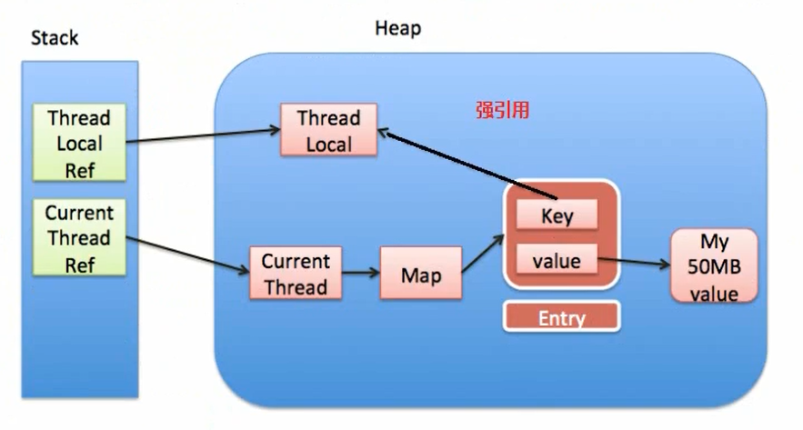

- 假设在业务代码中使用完ThreadLocal，threadLocal Ref被回收了
- 但是因为threadLocalMap的Entry强引用了threadLocal，造成threadLocal无法被回收。
- 在没有手动删除这个Entry以及CurrentThread依然运行的前提下，始终有强引用链 threadRef->currentThread->threadLocalMap->entry，Entry就不会被回收（Entry中包括了ThreadLocal实例和value），导致Entry内存泄漏。

也就是说，ThreadLocalMap中的key使用了强引用，是无法完全避免内存泄漏的。

### 如果key使用弱引用，那么会出现内存泄漏？

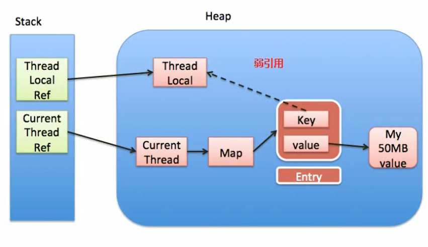

- 同样假设在业务代码中使用完ThreadLocal，threadLocal Ref被回收了。
- 由于ThreadLocalMap只持有ThreadLocal的弱引用，没有任何强引用指向threadlocal实例，所以threadloca就可以顺利被gc回收，此时Entry中的key=null。
- 但是在没有手动删除这个Entry以及CurrentThread依然运行的前提下，也存在有强引用链 threadRef->currentThread->threadLocalMap->entry-> value，value不会被回收，而这块value永远不会被访问到了，导致value内存泄漏。

也就是说，ThreadLocalMap中的key使用了弱引用，也有可能内存泄漏。

### 出现内存泄漏的真实原因

比较以上两种情况，我们就会发现，内存泄漏的发生跟ThreadLocalMap中的key是否使用弱引用是没有关系的。那么内存泄漏的的真正原因是什么呢？

细心的同学会发现，在以上两种内存泄漏的情况中，都有两个前提：

- 没有手动删除这个Entry
- CurrentThread依然运行

第一点很好理解，只要在使用完ThreadLocal，调用其remove方法删除对应的Entry，就能避免内存泄漏。

第二点稍微复杂一点，由于ThreadLocalMap是Thread的一个属性，被当前线程所引用，所以它的生命周期跟Thread一样长。那么在使用完ThreadLocal的使用，如果当前Thread也随之执行结束，ThreadLocalMap自然也会被gc回收，从根源上避免了内存泄漏。

综上，ThreadLocal内存泄漏的根源是：由于ThreadLocalMap的生命周期跟Thread-样长，如果没有手动删除对应key就会导致内存泄漏。

### 为什么要使用弱引用？

根据刚才的分析，我们知道了：无论ThreadLocalMap中的key使用哪种类型引用都无法完全避免内存泄漏，跟使用弱引用没有关系。

要避免内存泄漏有两种方式：

- 使用完ThreadLocal，调用其remove方法删除对应的Entry
- 使用完ThreadLocal，当前Thread也随之运行结束

相对第一种方式，第二种方式显然更不好控制，特别是使用线程池的时候，线程结束是不会销毁的，而是接着放入了线程池中。

也就是说，只要记得在使用完ThreadLocal及时的调用remove，无论key是强引用还是弱引用都不会有问题。
那么为什么key要用弱引用呢？

事实上，在ThreadLocalMap中的 set / getEntry方法中，会对key为null（也即是ThreadLocal为null）进行判断，如果为null的话，那么是会对value置为nul的。

这就意味着使用完ThreadLocal，CurrentThread依然运行的前提下，就算忘记调用remove方法，弱引用比强引用可以多一层保障：弱引用的ThreadLocal会被回收，对应的value在下一次ThreadLocalMap调用set，get，remove中的任一方法的时候会被清除，从而避免内存泄漏。

## Hash冲突的解决

hash冲突的解决是Map中的一个重要内容。我们以hash冲突的解决为线索，来研究一下ThreadLocalMap的核心源码。

首先从ThreadLocal的set方法入手

```java
public void set（T value）{
	Threadt=Thread.currentThread();
    ThreadLoca1.ThreadLocalMap map=getMap(t);
    if（mapl @= nu11）
//调用了ThreadLocalMap的set方法I 
        map.set(this，value);
    else 
        createMap（t，value);
}

ThreadLocal.ThreadLocalMap getMap（Thread t）{
	return t.threadLocals；
}

void createMap（Thread t，T firstValue）{
//调用了ThreadLocalMap的构造方法
t.threadlocals=new ThreadLocal.ThreadtocalMap(this，firstValue);
```

这个方法我们刚才分析过，其作用是设置当前线程绑定的局部变量

- 首先获取当前线程，并根据当前线程获取一个Map 
- 如果获取的Map不为空，则将参数设置到Map中（当前ThreadLocal的引用作为key)（这里调用了ThreadLocalMap的set方法）
- 如果Map为空，则给该线程创建Map，并设置初始值（这里调用了ThreadLocalMap的构造方法）

这段代码有两个地方分别涉及到ThreadLocalMap的两个方法，我们接着分析这两个方法

### 构造方法

ThreadLocalMap(ThreadLocal<?> firstKey, Object firstValue)

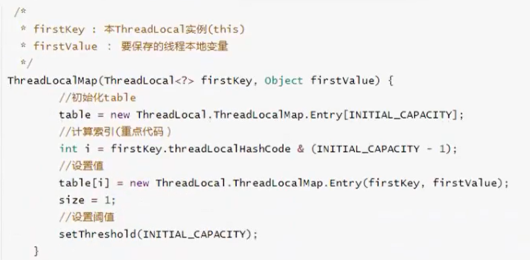

构造函数首先创建一个长度为16的Entry数组，然后计算出firstKey对应的索引，然后存储到table中，并设置size和threshold。

重点分析：int i = firstKey.threadLocalHashCode & ( INITIAL_CAPACITY - 1)

**关于：threadLocalHashCode** 


这里定义了一个Atomiclnteger类型，每次获取当前值并加上HASHINCREMENT，HASH_INCREMENT =
0x61c88647，这个值跟斐波那契数列（黄金分割数）有关，其主要目的就是为了让哈希码能均匀的分布在2的n次方的数组里，也就是EntryI table中，这样做可以尽量避免hash冲突。

**关于&（INITIAL_CAPACITY-1）**

计算hash的时候里面采用了hashCode&（size-1）的算法，这相当于取模运算hashCode%size的一个更高效的实现。正是因为这种算法，我们要求size必须是2的整次幂，这也能保证保证在索引不越界的前提下，使得hash发生冲突的次数减小。

### Get方法

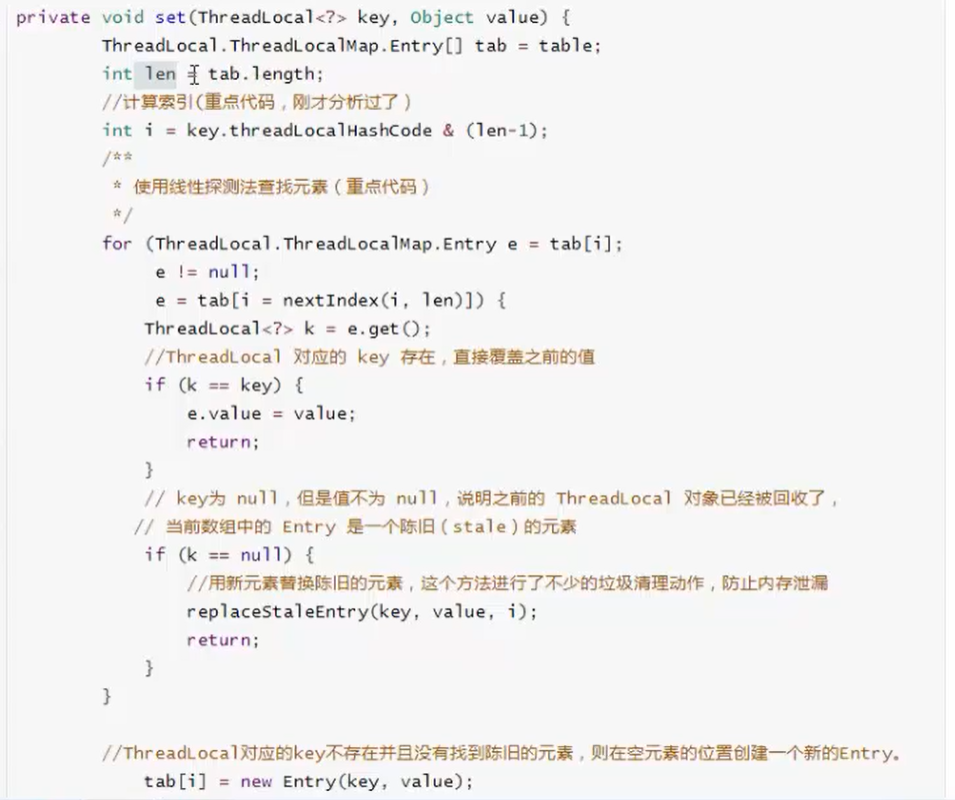


代码执行流程

- 首先还是根据key计算出索引i，然后查找位置上的Entry，
- 若是Entry已经存在并且key等于传入的key，那么这时候直接给这个Entry赋新的value值，
- 若是Entry存在，但是key为null，则调用replaceStaleEntry来更换这个key为空的Entry，
- 不断循环检测，直到遇到为null的地方，这时候要是还没在循环过程中return，那么就在这个null的位置新建一个Entry，并且插入，同时size增加1。

最后调用cleanSomeSlots，清理key为null的Entry，最后返回是否清理了Entry，接下来再判断sz是否>=
thresgold达到了rehash的条件，达到的话就会调用rehash函数执行一次全表的扫描清理。

### 线性探测法解决Hash冲突

该方法一次探测下一个地址，直到有空的地址后插入，若整个空间都找不到空余的地址，则产生溢出。

举个例子，假设当前table长度为16，也就是说如果计算出来key的hash值为14，如果table[14]上已经有值，并且其key与当前key不一致，那么就发生了hash冲突，这个时候将1401得到15，取table[15]进行判断，这个时候如果还是冲突会回到0，取table[0]，以此类推，直到可以插入。

按照上面的描述，可以把Entry table看成一个环形数组。

## ThreadLocal使用场景

### 源码使用场景

ThreadLocal的作用主要是做数据隔离，填充的数据只属于当前线程，变量的数据对别的线程而言是相对隔离的，在多线程环境下，如何防止自己的变量被其它线程篡改。

例如，用于 Spring实现事务隔离级别的源码

Spring采用Threadlocal的方式，来保证单个线程中的数据库操作使用的是同一个数据库连接，同时，采用这种方式可以使业务层使用事务时不需要感知并管理connection对象，通过传播级别，巧妙地管理多个事务配置之间的切换，挂起和恢复。

Spring框架里面就是用的ThreadLocal来实现这种隔离，主要是在`TransactionSynchronizationManager`这个类里面，代码如下所示:

```java
private static final Log logger = LogFactory.getLog(TransactionSynchronizationManager.class);

	private static final ThreadLocal<Map<Object, Object>> resources =
			new NamedThreadLocal<>("Transactional resources");

	private static final ThreadLocal<Set<TransactionSynchronization>> synchronizations =
			new NamedThreadLocal<>("Transaction synchronizations");

	private static final ThreadLocal<String> currentTransactionName =
			new NamedThreadLocal<>("Current transaction name");
```

Spring的事务主要是ThreadLocal和AOP去做实现的，我这里提一下，大家知道每个线程自己的链接是靠ThreadLocal保存的就好了

### 用户使用场景1

 除了源码里面使用到ThreadLocal的场景，你自己有使用他的场景么？

之前我们上线后发现部分用户的日期居然不对了，排查下来是SimpleDataFormat的锅，当时我们使用SimpleDataFormat的parse()方法，内部有一个Calendar对象，调用SimpleDataFormat的parse()方法会先调用Calendar.clear（），然后调用Calendar.add()，如果一个线程先调用了add()然后另一个线程又调用了clear()，这时候parse()方法解析的时间就不对了。

其实要解决这个问题很简单，让每个线程都new 一个自己的 SimpleDataFormat就好了，但是1000个线程难道new1000个SimpleDataFormat？

所以当时我们使用了线程池加上ThreadLocal包装SimpleDataFormat，再调用initialValue让每个线程有一个SimpleDataFormat的副本，从而解决了线程安全的问题，也提高了性能。

### 用户使用场景2

我在项目中存在一个线程经常遇到横跨若干方法调用，需要传递的对象，也就是上下文（Context），它是一种状态，经常就是是用户身份、任务信息等，就会存在过渡传参的问题。

使用到类似责任链模式，给每个方法增加一个context参数非常麻烦，而且有些时候，如果调用链有无法修改源码的第三方库，对象参数就传不进去了，所以我使用到了ThreadLocal去做了一下改造，这样只需要在调用前在ThreadLocal中设置参数，其他地方get一下就好了。

```java
before
  
void work(User user) {
    getInfo(user);
    checkInfo(user);
    setSomeThing(user);
    log(user);
}

then
  
void work(User user) {
try{
	  threadLocalUser.set(user);
	  // 他们内部  User u = threadLocalUser.get(); 就好了
    getInfo();
    checkInfo();
    setSomeThing();
    log();
    } finally {
     threadLocalUser.remove();
    }
}
```

我看了一下很多场景的cookie，session等数据隔离都是通过ThreadLocal去做实现的

在Android中，Looper类就是利用了ThreadLocal的特性，保证每个线程只存在一个Looper对象。

```java
static final ThreadLocal<Looper> sThreadLocal = new ThreadLocal<Looper>();
private static void prepare(boolean quitAllowed) {
    if (sThreadLocal.get() != null) {
        throw new RuntimeException("Only one Looper may be created per thread");
    }
    sThreadLocal.set(new Looper(quitAllowed));
}
```

## 参考

https://blog.csdn.net/qq_35190492/article/details/107599875

