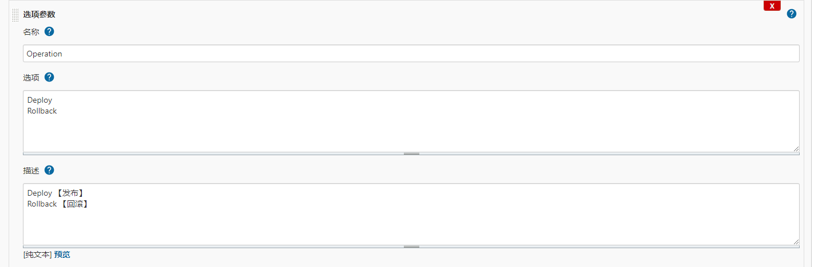
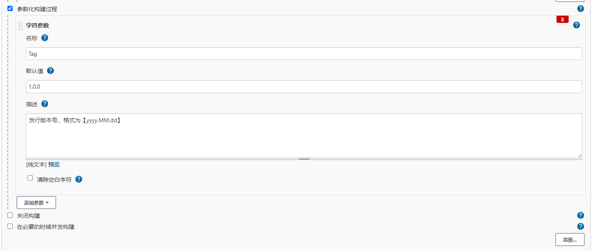
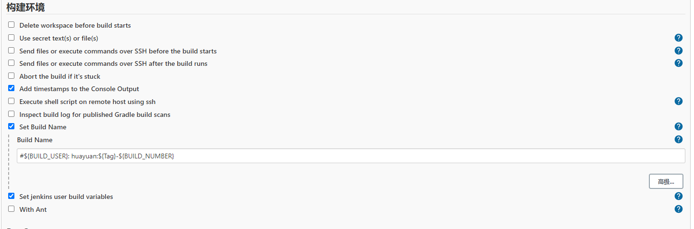
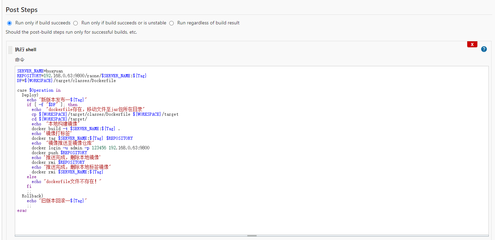
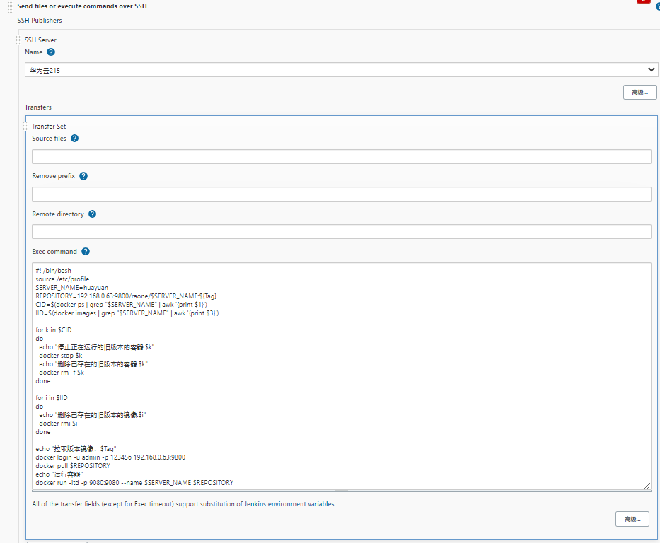

> **前提：服务器已安装docker、docker-compose、harbor**
>
> 通过参数化构建方式，使jenkins集成svn、maven并通过Harbor管理镜像，远程部署docker应用。

#### 1.添加构建类型参数及版本参数






#### 2.构建环境自定义构建名



#### 3.Post Steps操作

（1）构建镜像推送至镜像仓库



```shell
SERVER_NAME=huayuan
REPOSITORY=192.168.0.63:9800/raone/$SERVER_NAME:${Tag}
DF=${WORKSPACE}/target/classes/Dockerfile

case $Operation in
  Deploy)
    echo "新版本发布--${Tag}"
    if [ -f "$DF" ]; then
      echo  "dockerfile存在，移动文件至jar包所在目录"
      cp ${WORKSPACE}/target/classes/Dockerfile ${WORKSPACE}/target
      cd ${WORKSPACE}/target/
      echo  "本地构建镜像"
      docker build -t $SERVER_NAME:${Tag} .
      echo '镜像打标签'
      docker tag $SERVER_NAME:${Tag} $REPOSITORY
      echo  "镜像推送至镜像仓库"
      docker login -u admin -p 123456 192.168.0.63:9800
      docker push $REPOSITORY
      echo '推送完成，删除本地镜像'
      docker rmi $REPOSITORY
      echo "推送完成，删除本地标签镜像"
      docker rmi $SERVER_NAME:${Tag}
    else
      echo "dockerfile文件不存在！"
    fi
    ;;
  Rollback)
    echo "旧版本回滚--${Tag}"
    ;;
esac    
```

（1）远程发布



```shell
#! /bin/bash
source /etc/profile
SERVER_NAME=huayuan
REPOSITORY=192.168.0.63:9800/raone/$SERVER_NAME:${Tag}
CID=$(docker ps | grep "$SERVER_NAME" | awk '{print $1}')
IID=$(docker images | grep "$SERVER_NAME" | awk '{print $3}')

for k in $CID
do
  echo "停止正在运行的旧版本的容器:$k"
  docker stop $k
  echo "删除已存在的旧版本的容器:$k"
  docker rm -f $k
done

for i in $IID
do
  echo "删除已存在的旧版本的镜像:$i"
  docker rmi $i
done

echo "拉取版本镜像：$Tag"
docker login -u admin -p 123456 192.168.0.63:9800
docker pull $REPOSITORY
echo "运行容器"
docker run -itd -p 9080:9080 --name $SERVER_NAME $REPOSITORY
```

