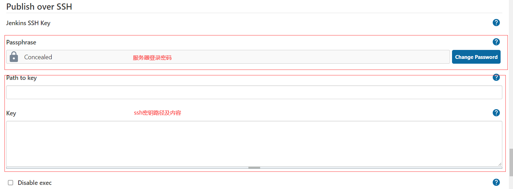
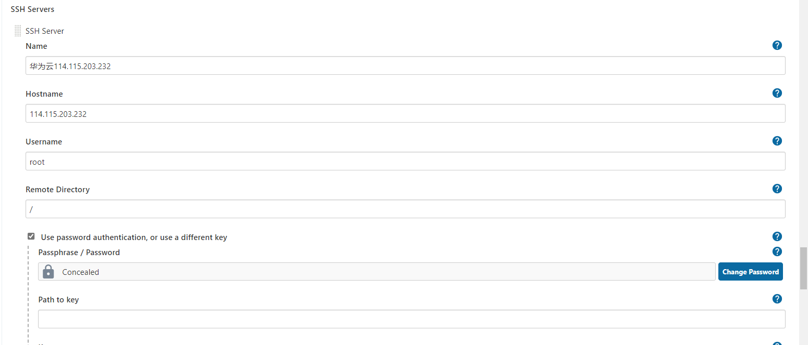
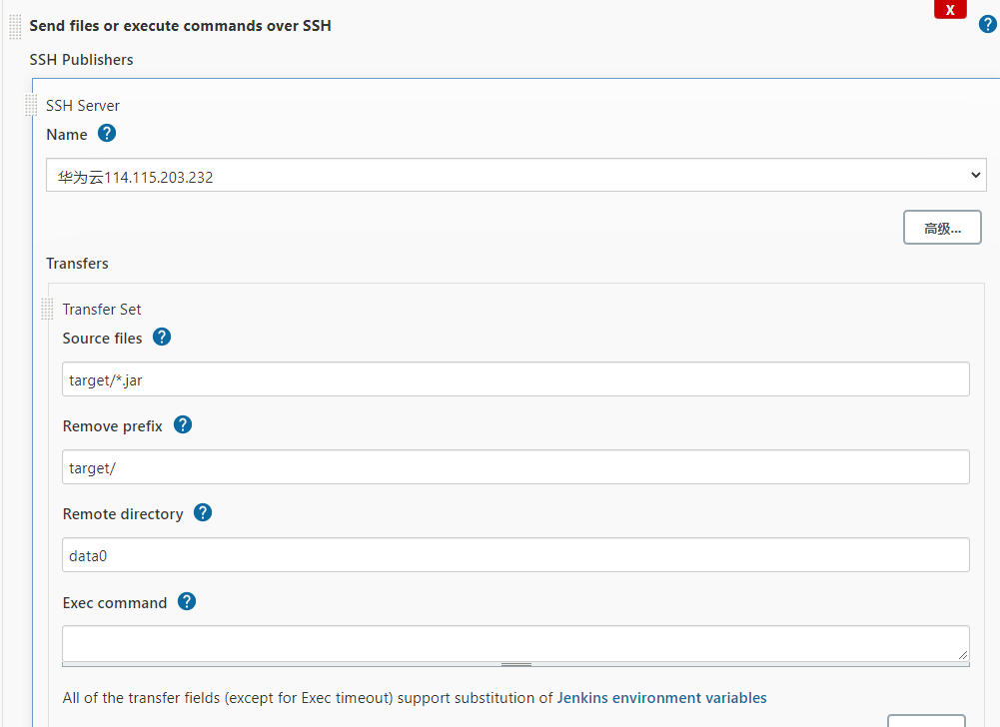
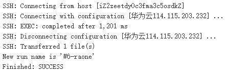

#### 1 系统配置

复制jenkins服务器生成的密钥，进行下面配置:



使用服务器密码或者SSH进行远程登录



参数说明：

* Passphrase        服务器的密码
* Path to key         连接远程服务器密钥文件的路径
* Key               密钥文件的内容 
* Name             自定义服务器名
* HostName         服务器IP外网地址
* UserName          服务器用户名
* Remote Directory   传输文件的目录

#### 2 构建项目配置

> Jenkins将文件传输到远程服务器上，并执行命令启动项目



参数说明：

* Source files   项目构建后的目录
* Remove prefix  去前缀
* Remote directoty 发布的目录
* Exec command   发布完执行的命令

#### 3. 添加远程执行shell命令（exec command）

（1）执行jar包

```shell
#! /bin/bash
source /etc/profile
ID=`ps -ef | grep huayuan | grep -v grep | awk '{print $2}'`
echo "杀死已存在的进程号"
for id in $ID
do
        kill -9 $id
        echo "killed $id"
done

export BUILD_ID=dontKillMe
nohup /data0/jdk/jdk1.8.0_111/bin/java -jar -Xms256M -Xmx512M -XX:PermSize=256M -XX:MaxPermSize=512M /data0/huayuan/huayuan.jar >> /data0/huayuan/nohup.out &
sleep 1


echo
```

（2）执行tomcat

```shell
#!/bin/bash
source /etc/profile
tomcat_home=/data0/raonecloud/tomcat8
ID=`ps -ef|grep tomcat|grep $tomcat_home|grep -v grep|awk '{print $2}'`
for id in $ID
do
        kill -9 $id
        echo -e "killed $id"
done

export BUILD_ID=dontKillMe
/data0/raonecloud/tomcat8/bin/startup.sh
echo -e "starting tomcat~~"
```

#### 4. 构建项目日志

