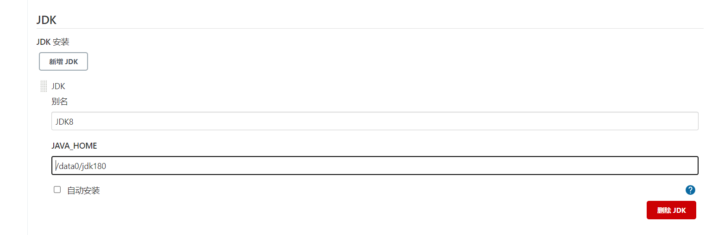

#### 1.下载war包

#### 2.添加环境变量：vim /etc/profile

```properties
JENKINS_HOME=/data0/jentins
export JENKINS_HOME
```

保存后刷新环境变量

#### 3.启动

```shell
# 启动方式1：
nohup java -jar xxx &
# 启动方式2：
# 将war包放到tomcat容器下启动
```


在启动日志中会打印一串密码，用于解锁


#### 4.安装插件

推荐安装或者自定义安装都行，推荐选择自定义安装【安装：maven integration,subversion,ssh】


#### 5.创建管理员用户及实例


例如：

* 创建管理员用户：raone	raone
* 邮箱：[xuyanfeng@sdrxhb.cn](http://xuyanfeng@sdrxhb.cn)
* 实例地址：[http://10.0.1.200:8080](http://10.0.1.172:8080)

#### 6.配置全局环境变量

【注：全局环境变量与jenkins在同一服务器】在服务器中安装JDK、maven





#### 7.创建任务


#### 8.任务配置


#### 9.源码管理


#### 10.svn凭证


#### 11.构建触发器，推荐手动构建，避免构建错误的版本上线


#### 12.构建环境


#### 13.build构建


#### 14.构建后，查看构建日志


#### 15.版本控制配置

（1）修改通用配置，添加选项参数和字符参数


（2）添加shell脚本，进行文件备份、回滚操作


```shell
case $Status  in
  Deploy)
    echo "Status:$Status"
    path="${WORKSPACE}/bak/${BUILD_NUMBER}"      #创建每次要备份的目录
    if [ -d $path ];
    then
        echo "The files is already  exists "
    else
        mkdir -p  $path
    fi
    \cp -f ${WORKSPACE}/target/*.jar $path        #将打包好的war包备份到相应目录,覆盖已存在的目标
    echo "Completing!"
    ;;
  Rollback)
      echo "Status:$Status"
      echo "Version:$Version"
      cd ${WORKSPACE}/bak/$Version            #进入备份目录
      \cp -f *.jar ${WORKSPACE}/target/       #将备份拷贝到程序打包目录中，并覆盖之前的war包
      ;;
  *)
  exit
      ;;
esac
```

（3）添加删除文件脚本，防止版本数量太多


```shell
ReservedNum=5  #保留文件数
FileDir=${WORKSPACE}/bak/
date=$(date "+%Y%m%d-%H%M%S")

cd $FileDir   #进入备份目录
FileNum=$(ls -l | grep '^d' | wc -l)   #当前有几个文件夹，即几个备份

while(( $FileNum > $ReservedNum))
do
    OldFile=$(ls -rt | head -1)         #获取最旧的那个备份文件夹
    echo  $date "Delete File:"$OldFile
    rm -rf $FileDir/$OldFile
    let "FileNum--"
done 
```

至此，版本备份和回滚已配置完成，如果构建的是war包，则只需要将降本中的jar替换成wai即可。