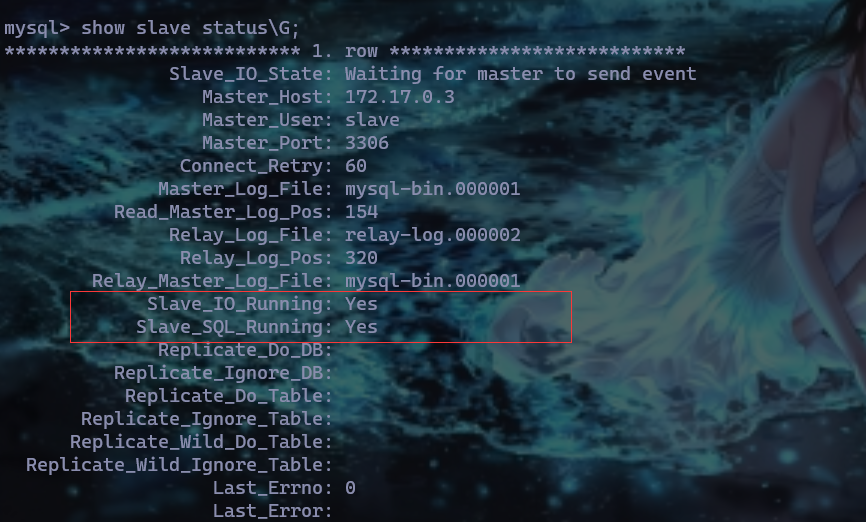

#### 1.编辑主节点mysql配置文件/etc/my.cnf

如果是docker环境，按以下步骤操作

```shell
# 进入容器内部
docker exec -it xx bash
# 安装vim
apt-get update
apt-get install vim
# 编辑配置文件
vi /etc/mysql/my.cnf
```

添加以下信息

```properties
[mysqld]
# 同一局域网内注意要唯一
server-id=1
# 开启二进制日志功能，可以随便取（关键）
log-bin=mysql-bin
# 开启独立表空间（5.6版本以上默认开启）
innodb-file-per-table =ON
# （1）配置需要同步的数据库，多个库用逗号分隔
# binlog-do-db=master
# （2）配置忽略同步库，如下在同步时忽略test数据库
# binlog-ignore-db = test
```

#### 2.重启mysql后，进入mysql内部，创建同步用户

```sql
CREATE USER 'slave'@'%' IDENTIFIED WITH mysql_native_password BY 'slave';
GRANT REPLICATION SLAVE, REPLICATION CLIENT ON *.* TO 'slave'@'%';
flush privileges;
```

### 3.查看二进制是否开启

```sql
# 查看主节点二进制日志是否开启
show global variables like '%log%';
# 查看主节点二进制文件
show master logs;
# 查看server信息
show global variables like '%server%';
```


#### 4.编辑从节点配置文件/etc/my.cnf

添加以下内容

```properties
[mysqld]
# relay_log配置中继日志
relay-log=relay-log
relay-log-index=relay-log.index
server-id=2
# 设定需要复制的数据库(多数据库使用逗号，隔开)
replicate-do-db=
# 设定需要忽略的复制数据库 (多数据库使用逗号，隔开)
# replicate-ignore-db= 
# 设定需要复制的表
# replicate-do-table=
# 设定需要忽略的复制表
# replicate-ignore-table=
# 同replication-do-table功能一样，但是可以加通配符（如下）
# replicate-wild-do-table=db_name.%
# 同replication-ignore-table功能一样，但是可以加通配符（如下）
replicate-wild-ignore-table=mysql.% 
```

重启mysql，进入mysql，

查看中继日志是否开启

```sql
show global variables like '%log%';
```

#### 5.配置访问主节点信息【MASTER_LOG_FILE是上面master logsr日志文件的最后一个,MASTER_LOG_POS要与上面的file size一致】

```sql
CHANGE MASTER TO MASTER_HOST='<主节点ip>',MASTER_USER='slave',MASTER_PASSWORD='slave', MASTER_LOG_FILE='mysql-bin.00001',MASTER_LOG_POS=154;
```

补充docker查看容器IP命令

```shell
docker inspect --format='{{.NetworkSettings.IPAddress}}' xxx
```

#### 6.查看从节点状态信息

```sql
SHOW SLAVE STATUS\G;
```


#### 7.启动复制线程

```sql
start slave;
```

再次查看



