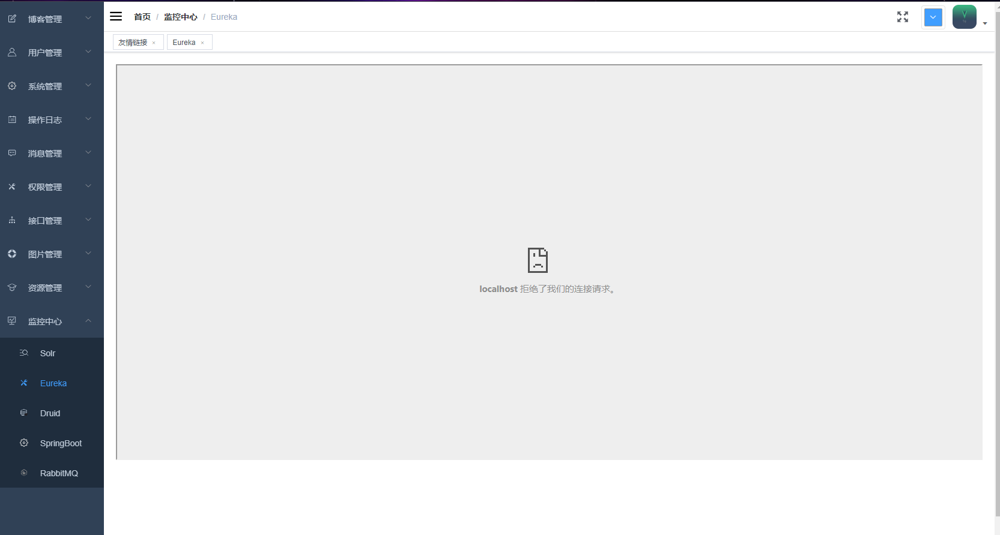
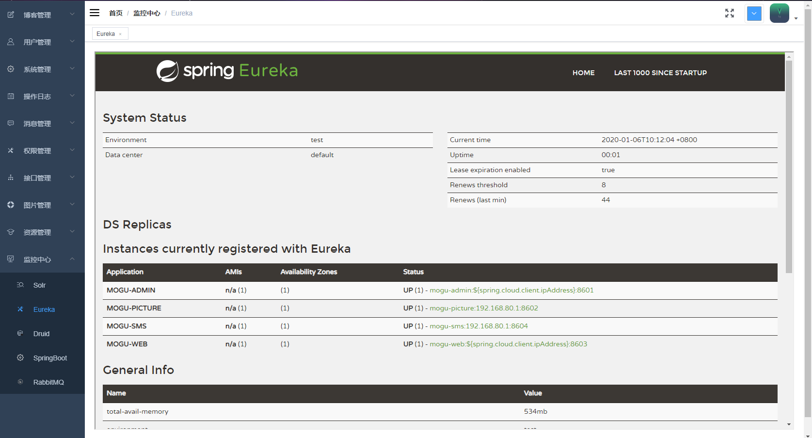

# Spring Security造成Eureka 无法使用iframe的内嵌页面的解决方法

## 前言

最近想写个监控页面，让eureka的管理页面能够嵌入到我们的后台管理中，我们使用“iframe”标签，代码如下所示：

```html
<template>
  <div class="app-container">
    <iframe  :src="adminSwaggerUrl" width="100%" height="660px;"></iframe>
  </div>
</template>

<script>

  export default {

    data() {
      return {
        adminSwaggerUrl: "http://localhost:8761",
      }
    },
    created() {

    },
    methods: {

    }
  }
</script>
```

但是发现无法直接正常显示：



F12打开调试页面，发现下列的错误信息：

```
Refused to display 'http://localhost:8761/' in a frame because it set 'X-Frame-Options' to 'deny'
```

这是因为Spring Security默认设置X-Frame-Options 为 deny：拒绝

## X-Frame-Options

下面介绍下X-Frame-Options主要用处是用于防止点击劫持，点击劫持（ClickJacking）是一种视觉上的欺骗手段。攻击者使用一个透明的iframe，覆盖在一个网页上，然后诱使用户在网页上进行操作，此时用户将在不知情的情况下点击透明的iframe页面。通过调整iframe页面的位置，可以诱使用户恰好点击在iframe页面的一些功能性按钮上。
HTTP响应头信息中的X-Frame-Options，可以指示浏览器是否应该加载一个iframe中的页面。如果服务器响应头信息中没有X-Frame-Options，则该网站存在ClickJacking攻击风险。网站可以通过设置X-Frame-Options阻止站点内的页面被其他页面嵌入从而防止点击劫持。

X-Frame-Options响应头。赋值有如下三种：

- DENY：不能被嵌入到任何iframe或者frame中。
- SAMEORIGIN：页面只能被本站页面嵌入到iframe或者frame中
- ALLOW-FROM uri：只能被嵌入到指定域名的框架中

## 解决方案

从这里就可以看到，是因为Spring Security默认设置X-Frame-Options响应头是 DENY，也就是不能被嵌入到任何iframe中，这也造成了我们无法正常显示eureka页面，所以我们需要在Spring Security的配置文件中设置关闭X-Frame-Options即可，也就是加入下面这句

```
.headers().frameOptions().disable();
```

完整代码如下：

```java
package com.moxi.mogublog.eureka.config;

import org.springframework.context.annotation.Configuration;
import org.springframework.security.config.annotation.web.builders.HttpSecurity;
import org.springframework.security.config.annotation.web.configuration.EnableWebSecurity;
import org.springframework.security.config.annotation.web.configuration.WebSecurityConfigurerAdapter;
import org.springframework.security.config.http.SessionCreationPolicy;

/**
 * WebSecurityConfig
 *
 * @author: 陌溪
 * @create: 2019-12-21-19:20
 */
@Configuration
@EnableWebSecurity
public class WebSecurityConfig extends WebSecurityConfigurerAdapter {

    /**
     * 高版本的丢弃了
     * <p>
     * security:
     * basic:
     * enabled: true
     * <p>
     * 配置，应该使用以下方式开启
     *
     * @param http
     * @throws Exception
     */
    @Override
    protected void configure(HttpSecurity http) throws Exception {
        // Configure HttpSecurity as needed (e.g. enable http basic).
        http.sessionManagement().sessionCreationPolicy(SessionCreationPolicy.NEVER);
        http.csrf().disable()
        .headers().frameOptions().disable();

        //注意：为了可以使用 http://${user}:${password}@${host}:${port}/eureka/ 这种方式登录,所以必须是httpBasic,
        // 如果是form方式,不能使用url格式登录
        http.authorizeRequests().anyRequest().authenticated().and().httpBasic();
    }

}
```

添加后，就能够正常显示页面了：



