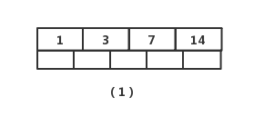
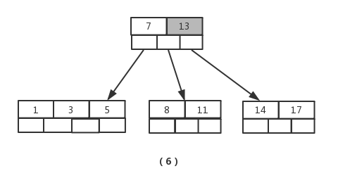
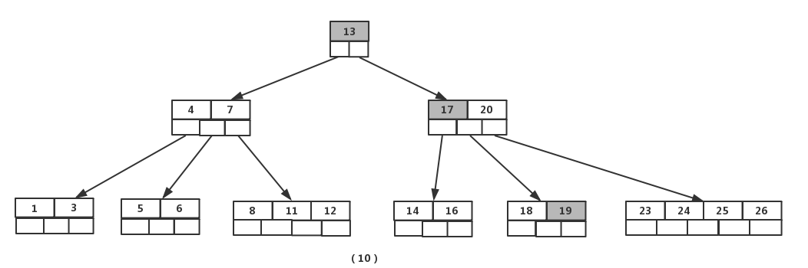
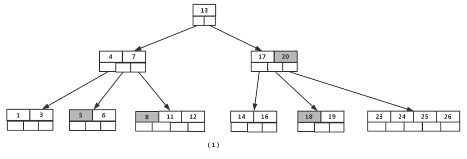

### 2i-11、二叉树的概念

* 树高度/深度：树中节点的最大层次

* 节点层数：从根开始定义起，根为第1层，根的子节点为第2层，以此类推

* 节点度数：一个节点含有的子树的个数称为该节点的度，二叉树的节点的度不大于2

* 树的度：一棵树中，最大的节点的度称为树的度

* 路径

* 叶节点：度为0的节点称为叶节点

* 分支节点：度不为0的节点

* 根节点：没有父节点的结点称为根节点

* 父节点：若一个节点含有子节点，则这个节点称为其子节点的父节点

* 子节点：一个节点含有的子树的根节点称为该节点的子节点

* 左节点

* 右节点

* 兄弟节点：具有相同父节点的节点互称为兄弟节点

* 祖先节点：从根到该节点所经分支上的所有节点

* 子孙节点：以某节点为根的子树中任一节点都称为该节点的子孙

* 左子树

* 右子树

  

### 2、二叉树的特点

* 二叉树的第 **i** 层上的节点数据最大为：
  $$
  2^{i-1} (i>=1)
  $$

* 深度为 **k** 的二叉树至多的节点数：
  $$
  2^k-1 (k>=1)
  $$

* 包含 **n** 个节点的二叉树的高度至少为：
  $$
  log_2n + 1
  $$
  
* 在任意一棵二叉树中，若终端结点的个数为**n0**，度为2的结点数为**n2**，则**n0=n2+1**

### 3、二叉树的分类

* **完全二叉树**：若设二叉树的高度为h，除第 h 层外，其它各层的结点数都达到最大个数，第h层有叶子结点，并且叶子结点都是从左到右依次排布

  

* **满二叉树**：（国际定义）除了叶结点外每一个结点都有左右子结点的二叉树；（国内定义）除了叶结点外每一个结点都有左右子叶且叶子结点都处在最底层的二叉树

  国内定义：

  

  国际定义：

  

* **平衡二叉树（AVL）**：是一棵空树或它的任意节点的左右两个子树的高度差的绝对值不超过1

  

* 扩充二叉树：扩充二叉树是对已有二叉树的扩充，扩充后的二叉树的节点都变为度数为2的分支节点

  
  
* **二叉搜索树（BST）**：所谓二叉搜索树，可提供对数时间的元素插入和访问。二叉搜索树的节点放置规则是：任何节点的键值一定大于去其左子树中的每一个节点的键值，并小于其右子树的每一个节点的键值。

  删除操作如下：

  

* **平衡二叉搜索树**：当插入节点导致树失去平衡时，通过旋转使树保持平衡

  左旋转：（1）节点的右孩子替代此节点位置 （2）右孩子的左子树变为该节点的右子树 （3）节点本身变为右孩子的左子树

  

  

  右旋转：（1）节点的左孩子代表此节点 （2）节点的左孩子的右子树变为节点的左子树 （3）将此节点作为左孩子节点的右子树。

  

  

* **红黑树**：又称RB-tree，是一种平衡二叉搜索树。（最长路径不超过最短路径的两倍）

  1. 每个节点，非黑即红。
  2. 根节点为黑。
  3. 每个叶子节点都是黑色的空节点（NIL节点）。
  4. 每个红色节点的两个子节点都是黑色。(从每个叶子到根的所有路径上不能有两个连续的红色节点)
  5. 任何节点，至其下属的、不同的叶节点的每条路径上，黑节点数必须相等。

​		例如：红黑树插入元素21时红黑树的变化如下

首先，我们需要做的是变色，把节点25及其下方的节点变色：

此时节点17和节点25是连续的两个红色节点，那么把节点17变成黑色节点？恐怕不合适。这样一来不但打破了规则4，而且根据规则2（根节点是黑色），也不可能把节点13变成红色节点。变色已无法解决问题，我们把节点13看做X，把节点17看做Y，像刚才的示意图那样进行左旋转：

由于根节点必须是黑色节点，所以需要变色，变色结果如下：

这样就结束了吗？并没有。因为其中两条路径(17 -> 8 -> 6 -> NIL)的黑色节点个数是4，其他路径的黑色节点个数是3，不符合规则5。这时候我们需要把节点13看做X，节点8看做Y，像刚才的示意图那样进行右旋转：

最后根据规则来进行变色：

* **哈夫曼树**：哈夫曼大叔说，从树中一个结点到另一个结点之间的分支构成2个结点之间的路径，路径上的分支数目称作路径长度。树的路径长度就是从树根到每一结点的路径长度之和。如果考虑到带权的结点，结点的带权的路径长度就为从该结点到树根之间的路径长度与结点上权的乘积。树的带权路径长度为树中所有叶子结点的带权路径长度之和。

  假设有n个权值{W1,W2…,Wn}，构造一棵n个叶子结点的二叉树，每个叶子结点带权Wk，每个叶子的路径长度为1k，我们通常记作，其中带权路径长度WPL最小的二叉树称为哈夫曼树（又称==最优二叉树==）。

### 4、二叉树的应用场景

* AVL树: 最早的平衡二叉树之一。应用相对其他数据结构比较少。windows对进程地址空间的管理用到了AVL树
* 红黑树: 平衡二叉树，广泛用在C++的STL中。如map和set都是用红黑树实现的。还有Linux文件管理
* B/B+树: 用在磁盘文件组织数据索引和数据库索引
* Trie树(字典树): 用在统计和排序大量字符串，如自动机、M数据库索引

### 5、二叉树的遍历方式

- 前序遍历：root -> left -> right：[ 根节点, [左子树的前序遍历结果], [右子树的前序遍历结果] ]
- 中序遍历：left -> root -> right：[ [左子树的中序遍历结果], 根节点, [右子树的中序遍历结果] ]
- 后续遍历：left ->right -> root：[ [左子树的后序遍历结果], [右子树的后序遍历结果],根节点 ]
- 层序遍历：按照层次遍历

### 6、二叉树存储结构

* 顺序结构

  

* 链式结构

  * 二叉链表：当前节点值域、指向当前节点的左孩子、指向当前节点的右孩子

  * 三叉链表：当前节点值域、指向当前节点的左孩子、指向当前节点的右孩子、当前节点的双亲

    

### 7、多路查找树【二叉树，又叫二路查找树】

* **2-3树**：

  1、其中每一个节点都有两个孩子（称为2节点）或三个孩子（三节点）或者没有。
  2、子节点排序参考二叉树
  3、一个二节点包含一个元素和两个子节点（或没有子节点），一个三节点包含两个元素和三个子节点（或没有子节点）
  4、2-3树中所有的叶子节点都在同一层次上。

  

* **B树（B-Tree）**：

  ​		平衡二叉树的查找效率是非常高的，并可以通过降低树的深度来提高查找的效率。但是当数据量非常大，树的存储的元素数量是有限的，这样会导致二叉查找树结构由于树的深度过大而造成磁盘I/O读写过于频繁，进而导致查询效率低下。另外数据量过大会导致内存空间不够容纳平衡二叉树所有结点的情况。B树是解决这个问题的很好的结构

  ​		B树是一种==平衡的多路查找树==。节点最大的孩子的数量的树叫做m阶B数。所以2-3树就是3阶B树，二叉树就是2阶B树。

  B树有如下性质：

  （1）如果根节点不是叶节点，那么B树至少有两叉。
  （2）所有叶子节点都位于同一层次。
  （3）每一个非根的分支结点都有k-1个元素和k个孩子，其中[m/2]<k<m. 21每一个叶子结点n都有k-1个元素，其中[m/2]<k< m.
  （4）在B树上的查找过程是一个顺指针查找节点和在节点中查找关键字的交叉过程。

  如下图中，节点【13,16,19】拥有的子节点数目最多，四个子节点（灰色节点），所以可以定义上面的图片为4阶B树。

  

  * 插入

    针对m阶高度h的B树，插入一个元素时，首先在B树中是否存在，如果不存在，即在叶子结点处结束，然后在叶子结点中插入该新的元素。

    - 若该节点元素个数小于m-1，直接插入；
    - 若该节点元素个数等于m-1，引起节点分裂；以该节点中间元素为分界，取中间元素（偶数个数，中间两个随机选取）插入到父节点中；
    - 重复上面动作，直到所有节点符合B树的规则；最坏的情况一直分裂到根节点，生成新的根节点，高度增加1；

    以5阶B树为例，5阶B树的关键点

    - 2<=根节点子节点个数<=5
    - 3<=内节点子节点个数<=5
    - 1<=根节点元素个数<=4
    - 2<=非根节点元素个数<=4

    初始为：

    

    插入8：

    

    图（1）插入元素【8】后变为图（2），此时根节点元素个数为5，不符合 1<=根节点元素个数<=4，进行分裂（真实情况是先分裂，然后插入元素，这里是为了直观而先插入元素，下面的操作都一样，不再赘述），取节点中间元素【7】，加入到父节点，左右分裂为2个节点，如图（3）

    

    接着插入元素【5】，【11】，【17】时，不需要任何分裂操作，如图（4）

    

    插入元素【13】

    

    节点元素超出最大数量，进行分裂，提取中间元素【13】，插入到父节点当中，如图（6）

    

    接着插入元素【6】，【12】，【20】，【23】时，不需要任何分裂操作，如图（7）

    

    插入【26】时，最右的叶子结点空间满了，需要进行分裂操作，中间元素【20】上移到父节点中，注意通过上移中间元素，树最终还是保持平衡，分裂结果的结点存在2个关键字元素。

    

    插入【4】时，导致最左边的叶子结点被分裂，【4】恰好也是中间元素，上移到父节点中，然后元素【16】,【18】,【24】,【25】陆续插入不需要任何分裂操作

    

    最后，当插入【19】时，含有【14】,【16】,【17】,【18】的结点需要分裂，把中间元素【17】上移到父节点中，但是情况来了，父节点中空间已经满了，所以也要进行分裂，将父节点中的中间元素【13】上移到新形成的根结点中，这样具体插入操作的完成。

    

  * 删除

    首先查找B树中需删除的元素,如果该元素在B树中存在，则将该元素在其结点中进行删除；删除该元素后，首先判断该元素是否有左右孩子结点，如果有，则上移孩子结点中的某相近元素(“左孩子最右边的节点”或“右孩子最左边的节点”)到父节点中，然后是移动之后的情况；如果没有，直接删除。

    - 某结点中元素数目小于（m/2）-1,(m/2)向上取整，则需要看其某相邻兄弟结点是否丰满；
    - 如果丰满（结点中元素个数大于(m/2)-1），则向父节点借一个元素来满足条件；
    - 如果其相邻兄弟都不丰满，即其结点数目等于(m/2)-1，则该结点与其相邻的某一兄弟结点进行“合并”成一个结点；

    接下来还以5阶B树为例，详细讲解删除的动作；

    - 关键要领，元素个数小于 2（m/2 -1）就合并，大于4（m-1）就分裂

    如图依次删除依次删除【8】,【20】,【18】,【5】

    

    首先删除元素【8】，当然首先查找【8】，【8】在一个叶子结点中，删除后该叶子结点元素个数为2，符合B树规则，操作很简单，咱们只需要移动【11】至原来【8】的位置，移动【12】至【11】的位置（也就是结点中删除元素后面的元素向前移动）

    

     下一步，删除【20】,因为【20】没有在叶子结点中，而是在中间结点中找到，咱们发现他的继承者【23】(字母升序的下个元素)，将【23】上移到【20】的位置，然后将孩子结点中的【23】进行删除，这里恰好删除后，该孩子结点中元素个数大于2，无需进行合并操作。

    

    下一步删除【18】，【18】在叶子结点中,但是该结点中元素数目为2，删除导致只有1个元素，已经小于最小元素数目2,而由前面我们已经知道：如果其某个相邻兄弟结点中比较丰满（元素个数大于ceil(5/2)-1=2），则可以向父结点借一个元素，然后将最丰满的相邻兄弟结点中上移最后或最前一个元素到父节点中，在这个实例中，右相邻兄弟结点中比较丰满（3个元素大于2），所以先向父节点借一个元素【23】下移到该叶子结点中，代替原来【19】的位置，【19】前移；然【24】在相邻右兄弟结点中上移到父结点中，最后在相邻右兄弟结点中删除【24】，后面元素前移。

    

    最后一步删除【5】， 删除后会导致很多问题，因为【5】所在的结点数目刚好达标，刚好满足最小元素个数（ceil(5/2)-1=2）,而相邻的兄弟结点也是同样的情况，删除一个元素都不能满足条件，所以需要该节点与某相邻兄弟结点进行合并操作；首先移动父结点中的元素（该元素在两个需要合并的两个结点元素之间）下移到其子结点中，然后将这两个结点进行合并成一个结点。所以在该实例中，咱们首先将父节点中的元素【4】下移到已经删除【5】而只有【6】的结点中，然后将含有【4】和【6】的结点和含有【1】,【3】的相邻兄弟结点进行合并成一个结点。

    

    也许你认为这样删除操作已经结束了，其实不然，在看看上图，对于这种特殊情况，你立即会发现父节点只包含一个元素【7】，没达标（因为非根节点包括叶子结点的元素K必须满足于2=<K<=4，而此处的K=1），这是不能够接受的。如果这个问题结点的相邻兄弟比较丰满，则可以向父结点借一个元素。而此时兄弟节点元素刚好为2，刚刚满足，只能进行合并，而根结点中的唯一元素【13】下移到子结点，这样，树的高度减少一层。

    

    

* **B+树（B+Tree）**:

  B+树的特征：

  - 有m个子树的中间节点包含有m个元素（B树中是k-1个元素），每个元素不保存数据，只用来索引；
  - 所有的叶子结点中包含了全部关键字的信息，及指向含有这些关键字记录的指针，且叶子结点本身依关键字的大小自小而大的顺序链接。 (而B 树的叶子节点并没有包括全部需要查找的信息)；
  - 所有的非终端结点可以看成是索引部分，结点中仅含有其子树根结点中最大（或最小）关键字。 (而B 树的非终节点也包含需要查找的有效信息)；

  1）B+树的磁盘读写代价更低

  　　B+树的内部结点并没有指向关键字具体信息的指针。因此其内部结点相对B 树更小。如果把所有同一内部结点的关键字存放在同一盘块中，那么盘块所能容纳的关键字数量也越多。一次性读入内存中的需要查找的关键字也就越多。相对来说IO读写次数也就降低了；

  2）B+树查询效率更加稳定

  　　由于非终结点并不是最终指向文件内容的结点，而只是叶子结点中关键字的索引。所以任何关键字的查找必须走一条从根结点到叶子结点的路。所有关键字查询的路径长度相同，导致每一个数据的查询效率相当；

  3）B+树便于范围查询（最重要的原因，范围查找是数据库的常态）

  　　B树在提高了IO性能的同时并没有解决元素遍历的我效率低下的问题，正是为了解决这个问题，B+树应用而生。B+树只需要去遍历叶子节点就可以实现整棵树的遍历。而且在数据库中基于范围的查询是非常频繁的，而B树不支持这样的操作或者说效率太低；不懂可以看看这篇解读-》[范围查找](https://zhuanlan.zhihu.com/p/54102723)

  > 补充：B树的范围查找用的是中序遍历，而B+树用的是在链表上遍历；

