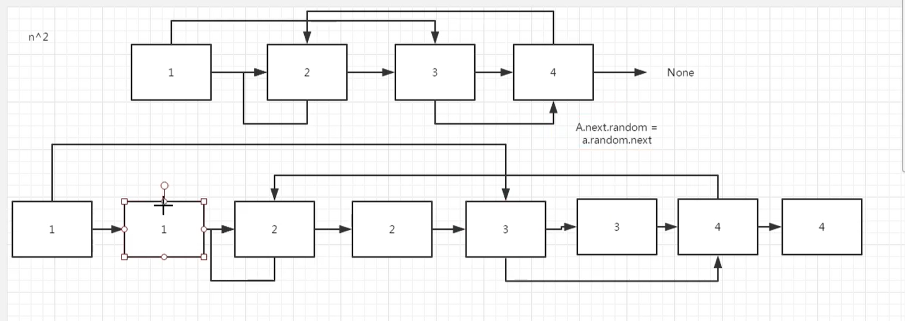
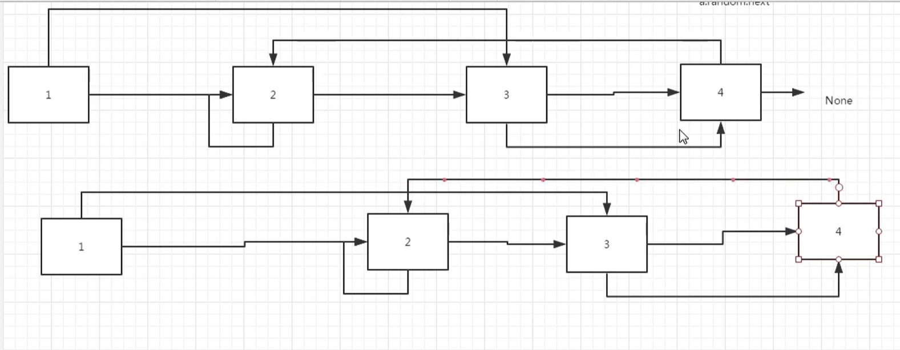
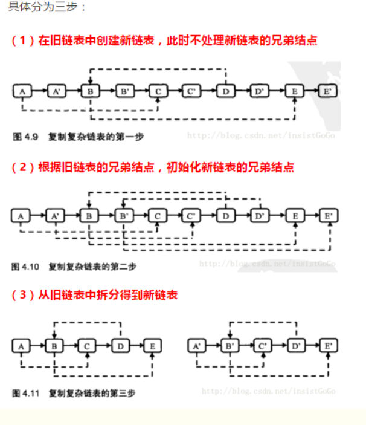

## 描述

来源：https://www.nowcoder.com/practice/f836b2c43afc4b35ad6adc41ec941dba

输入一个复杂链表（每个节点中有节点值，以及两个指针，一个指向下一个节点，另一个特殊指针random指向一个随机节点），请对此链表进行深拷贝，并返回拷贝后的头结点。（注意，输出结果中请不要返回参数中的节点引用，否则判题程序会直接返回空）

## 思考

下图是复杂链表的数据结构

```python
# 链表结构
class RandomListNode:
    def __init__(self, x):
        self.label = x
        self.next = None
        self.random = None
```


最简单的思路是，使用python提供的深拷贝实现

```python
import copy
class Solution:
    # 返回 RandomListNode
    def Clone(self, pHead):
        # write code here
        return copy.deepcopy(pHead)
```

## 方法2

关于Random指针，因为我们不知道它是指向，因此我们每次都需要从头到尾进行遍历

我们要做的就是把上面的节点复制一份出来



这样得到了： 11,22,33,44 的链表，就相当于在每个数的后面，同时又复制了一份，最后执行一下的方法

> A.next.random = a.random.next

最后我们得到了两个链表




完整图



完整代码

```python
# 复杂链表的复制
# 输入一个复杂链表（每个节点中有节点值，以及两个指针，一个指向下一个节点，另一个特殊指针random指向一个随机节点），
# 请对此链表进行深拷贝，并返回拷贝后的头结点。（注意，输出结果中请不要返回参数中的节点引用，否则判题程序会直接返回空）

# 链表结构
class Solution:
    # 返回合并后列表
    def Clone(self, pHead):
        if pHead == None:
            return None
        pTmp = pHead
        # 复制一个一样的node，并且添加到之前的链表的每一个node后面
        while pTmp:
            # 创建一个和原来一样的node
            node = RandomListNode(pTmp.laebl)
            node.next = pTmp.next
            # 将原来的指向刚刚创建的节点
            pTmp.next = node
            # 同时移动被复制的节点
            pTmp = node.next

        # 实现新建node的random的指向
        pTmp = pHead
        while pHead:
            # 将复制节点的random，指向 它Random的next
            if pTmp.random:
                pTmp.next.random = pTmp.random.next
            pTmp = pTmp.next.next

        # 断开原来的node 和 新 node 之间的连接
        pTmp = pHead
        newHead = pHead.next
        pNewTmp = pHead.next
        while pTmp:
            pTmp.next = pTmp.next.next
            if pNewTmp.next:
                pNewTmp.next = pNewTmp.next.next
                pNewTmp = pNewTmp.next
            pTmp = pTmp.next            
        return newHead

```

